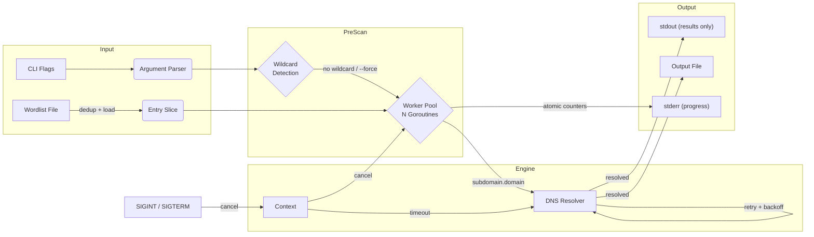

<div align="center">

<h1>subenum</h1>

**Fast, concurrent subdomain enumeration via DNS brute-forcing. Written in pure Go.**

<br>

[](https://github.com/TMHSDigital/subenum/actions)
[](LICENSE)
<!-- Update Go version badge when go.mod changes -->
[](https://go.dev)
[](https://github.com/TMHSDigital/subenum/actions/workflows/codeql.yml)
[](https://github.com/TMHSDigital/subenum/releases)
[](https://goreportcard.com/report/github.com/TMHSDigital/subenum)

`Concurrent Workers` &middot; `Context-Aware Cancellation` &middot; `Retry with Backoff` &middot; `Wildcard Detection` &middot; `Simulation Mode` &middot; `Zero Dependencies`

[Quick Start](#installation) | [Documentation](./docs) | [Architecture](#system-architecture) | [Changelog](./CHANGELOG.md)

</div>

<br>

---

<br>

## Feature Matrix

| Module | Capabilities |
| :--- | :--- |
| Worker Pool | Spawn N goroutines for parallel DNS resolution with configurable concurrency ceiling. |
| DNS Engine | Resolve subdomains against any custom DNS server with per-query timeouts and exponential-backoff retries. |
| Wildcard Detection | Double-probe random subdomain check before scanning; exits early unless `-force` is set. |
| Graceful Shutdown | Trap SIGINT/SIGTERM, drain in-flight workers, flush partial results to disk. |
| Input Validation | Enforce RFC-compliant domain syntax and strict IP:port format for DNS server arguments. |
| Wordlist Dedup | Automatically remove duplicate entries from the wordlist before scanning. |
| Simulation Mode | Generate synthetic DNS results at a configurable hit rate without network I/O. |
| Output Pipeline | Stream resolved domains to stdout (pipe-friendly); progress and diagnostics go to stderr. |
| Progress Reporting | Live terminal progress with atomic counters, updated on a 2-second ticker. |

<br>

---

<br>

## System Architecture



<br>

---

<br>

> [!IMPORTANT]
> **Authorized use only.** Only scan domains you own or have explicit written permission to test. Unauthorized scanning may violate applicable laws. Users are solely responsible for compliance.

> [!NOTE]
> **Wildcard DNS detection.** Before scanning, subenum resolves two random subdomains to check for wildcard DNS. If the domain uses wildcard records, the tool exits with a warning (all subdomains would resolve, making results meaningless). Pass `-force` to override and scan anyway.

> [!CAUTION]
> **Simulation mode** (`-simulate`) generates synthetic results and performs zero network I/O. Do not confuse simulated output with real DNS data.

<br>

---

<br>

## Installation

**Prerequisites:** `Go >= 1.22` &middot; `Git` &middot; `Make` (optional) &middot; `Docker` (optional)

**One-liner (build from source):**

```bash
git clone https://github.com/TMHSDigital/subenum.git && cd subenum && go build -buildvcs=false -o subenum
```

**Pre-built binaries:** download from the [Releases](https://github.com/TMHSDigital/subenum/releases) page (Linux, macOS, Windows).

**Docker:**

```bash
docker build -t subenum . && docker run --rm -v $(pwd)/data:/data subenum -w /data/wordlist.txt example.com
```

**Make:**

```bash
make build        # compile binary
make simulate     # safe run, no DNS queries
make help         # list all targets
```

<br>

### Configuration

| Flag | Default | Description |
| :--- | :--- | :--- |
| `-w <file>` | -- | Wordlist file, one prefix per line **(required)** |
| `-t <n>` | `100` | Concurrent worker goroutines |
| `-timeout <ms>` | `1000` | Per-query DNS timeout in milliseconds |
| `-dns-server <ip:port>` | `8.8.8.8:53` | DNS server address (validated on startup) |
| `-attempts <n>` | `1` | Total DNS resolution attempts per subdomain (1 = no retry) |
| `-force` | `false` | Continue scanning even if wildcard DNS is detected |
| `-o <file>` | -- | Write results to file in addition to stdout |
| `-v` | `false` | Verbose output: IPs, timings, per-query status (written to stderr) |
| `-progress` | `true` | Live progress line on stderr (disable with `-progress=false`) |
| `-simulate` | `false` | Simulation mode: no real DNS queries |
| `-hit-rate <n>` | `15` | Simulated resolution rate, percent (1-100) |
| `-version` | -- | Print version and exit |
| `-retries <n>` | -- | **Deprecated:** alias for `-attempts`, prints a warning |

<br>

---

<br>

## Usage

```bash
subenum -w <wordlist> [flags] <domain>
```

**Basic scan:**

```bash
./subenum -w wordlist.txt example.com
```

**High-throughput with Cloudflare DNS, saving results:**

```bash
./subenum -w wordlist.txt -t 300 -timeout 500 -dns-server 1.1.1.1:53 -o results.txt example.com
```

**Resilient scan for flaky networks:**

```bash
./subenum -w wordlist.txt -attempts 3 -timeout 2000 example.com
```

**Pipe-friendly output (progress goes to stderr, only results on stdout):**

```bash
./subenum -w wordlist.txt example.com | cut -d' ' -f2 | your-takeover-scanner
```

**Force scan on wildcard domain:**

```bash
./subenum -w wordlist.txt -force example.com
```

**Simulation (zero network I/O):**

```bash
./subenum -simulate -hit-rate 20 -w examples/sample_wordlist.txt example.com
```

**Graceful shutdown:** press `Ctrl+C` at any time. In-flight queries drain, partial results are flushed.

<br>

---

<br>

<details>
<summary><strong>Project Anatomy</strong></summary>

<br>

```
subenum/
├── .github/
│   ├── workflows/
│   │   ├── go.yml              # CI: build, test, lint, release
│   │   ├── codeql.yml          # Weekly CodeQL security analysis
│   │   └── pages.yml           # GitHub Pages deployment
│   ├── ISSUE_TEMPLATE/
│   │   ├── bug_report.md       # Structured bug report form
│   │   └── feature_request.md  # Feature proposal template
│   ├── dependabot.yml          # Automated dependency updates
│   └── PULL_REQUEST_TEMPLATE.md
├── data/
│   └── wordlist.txt            # Default wordlist for Docker/Make
├── docs/
│   ├── ARCHITECTURE.md         # Internals: worker pool, context, output
│   ├── CONTRIBUTING.md         # PR workflow, testing, ethical guidelines
│   ├── DEVELOPER_GUIDE.md      # Build, test, project structure
│   ├── DOCUMENTATION_STRUCTURE.md
│   ├── docker.md               # Container setup and volume mounting
│   ├── _config.yml             # Jekyll config for GitHub Pages
│   └── index.md                # GitHub Pages landing page
├── examples/
│   ├── sample_wordlist.txt     # 50-entry starter wordlist
│   ├── advanced_usage.md       # Scripting and integration patterns
│   ├── demo.sh                 # Quick demo script
│   └── multi_domain_scan.sh    # Batch scanning example
├── internal/
│   ├── dns/
│   │   ├── resolver.go         # ResolveDomain, ResolveDomainWithRetry, CheckWildcard
│   │   ├── resolver_test.go    # DNS resolution and wildcard detection tests
│   │   ├── simulate.go         # SimulateResolution (synthetic DNS)
│   │   └── simulate_test.go    # Simulation logic tests
│   ├── output/
│   │   ├── writer.go           # Thread-safe output (results→stdout, rest→stderr)
│   │   └── writer_test.go      # Output writer tests
│   └── wordlist/
│       ├── reader.go           # LoadWordlist (dedup + sanitize)
│       └── reader_test.go      # Wordlist loading and dedup tests
├── tools/
│   └── wordlist-gen.go         # Custom wordlist generator utility
├── main.go                     # CLI entry point: flag parsing, wiring
├── main_test.go                # CLI-level tests: validation, flag logic
├── go.mod                      # Go module (zero external dependencies)
├── Dockerfile                  # Multi-stage Alpine build
├── docker-compose.yml          # Compose orchestration
├── Makefile                    # Build, test, lint, simulate, Docker targets
├── .gitattributes              # Line-ending normalization rules
├── .golangci.yml               # Linter configuration (golangci-lint v2)
├── CHANGELOG.md                # Versioned release history
├── SECURITY.md                 # Vulnerability disclosure policy
└── LICENSE                     # GNU General Public License v3.0
```

</details>

<br>

---

<br>

## Tech Stack

| | |
| :--- | :--- |
| **Core Engine** | `Go 1.22` &middot; `net.Resolver` &middot; `context` &middot; `sync/atomic` |
| **Concurrency** | `goroutines` &middot; `channels` &middot; `sync.WaitGroup` &middot; `sync.Mutex` |
| **Infrastructure** | `Docker` &middot; `Alpine` &middot; `Make` &middot; `docker-compose` |
| **CI/CD** | `GitHub Actions` &middot; `CodeQL` &middot; `Dependabot` &middot; `golangci-lint` |
| **Quality** | `go test -race` &middot; `golangci-lint v2` &middot; `gosec` &middot; `govet` |

<br>

---

<br>

## Development

See [CONTRIBUTING.md](./docs/CONTRIBUTING.md) for the pull request workflow and ethical guidelines.
See [DEVELOPER_GUIDE.md](./docs/DEVELOPER_GUIDE.md) for build instructions, testing, and project structure.

<br>

---

<br>

<div align="center">

[License (GPL-3.0)](./LICENSE) &middot; [TM Hospitality Strategies](https://github.com/TMHSDigital) &middot; [Security Policy](./SECURITY.md)

</div>
