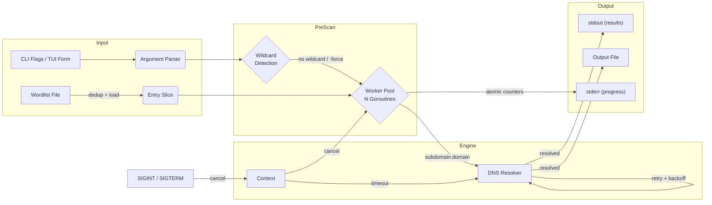
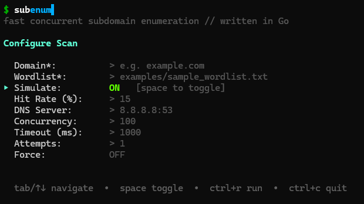

<div align="center">


<br>

[](https://github.com/TMHSDigital/subenum/actions)
[](https://github.com/TMHSDigital/subenum/releases)
[](https://go.dev)
[](LICENSE)
[](https://github.com/TMHSDigital/subenum/actions/workflows/codeql.yml)
[](https://goreportcard.com/report/github.com/TMHSDigital/subenum)

<br>

[Quick Start](#installation) &nbsp;|&nbsp; [Configuration](#configuration) &nbsp;|&nbsp; [Usage](#usage) &nbsp;|&nbsp; [Architecture](#system-architecture) &nbsp;|&nbsp; [Changelog](./CHANGELOG.md)

</div>

<br>

---

> [!IMPORTANT]
> **Authorized use only.** Only scan domains you own or have explicit written permission to test. Unauthorized scanning may violate applicable laws. Users are solely responsible for compliance with all applicable laws and regulations.

---

<br>

## Feature Matrix

| Module | Description |
| :--- | :--- |
| Worker Pool | Spawn N goroutines for parallel DNS resolution with a configurable concurrency ceiling |
| DNS Engine | Resolve subdomains against any DNS server with per-query timeouts and retry backoff |
| Wildcard Detection | Double-probe check before scanning; aborts early unless `-force` is set |
| Graceful Shutdown | Trap SIGINT/SIGTERM, drain in-flight workers, flush partial results |
| Input Validation | RFC-compliant domain syntax and strict `ip:port` format enforcement |
| Wordlist Dedup | Deduplicate wordlist entries in a single pass before scanning begins |
| Simulation Mode | Generate synthetic DNS results at a configurable hit rate — zero network I/O |
| Output Pipeline | Resolved domains to stdout (pipe-clean); progress and diagnostics to stderr |
| Interactive TUI | Form-based config and live-scrolling results via `-tui`; session values persisted |

<br>

---

<br>

## System Architecture



<br>

---

<br>

## Installation

**Prerequisites:** Go 1.22+ &middot; Git &middot; Make _(optional)_ &middot; Docker _(optional)_

<details>
<summary><strong>Build from source</strong></summary>

```bash
git clone https://github.com/TMHSDigital/subenum.git
cd subenum
go build -buildvcs=false -o subenum
```

</details>

<details>
<summary><strong>Pre-built binaries</strong></summary>

Download the appropriate binary for your platform from the [Releases](https://github.com/TMHSDigital/subenum/releases) page.

Platforms: Linux (amd64, arm64) &middot; macOS (amd64, arm64) &middot; Windows (amd64)

SHA-256 checksums are provided alongside each binary.

</details>

<details>
<summary><strong>Docker</strong></summary>

```bash
docker build -t subenum .
docker run --rm -v $(pwd)/data:/data subenum -w /data/wordlist.txt example.com
```

Or with Compose:

```bash
docker compose run subenum
```

</details>

<details>
<summary><strong>Make targets</strong></summary>

```bash
make build          # compile binary
make test           # run test suite with race detector
make lint           # run golangci-lint
make simulate       # safe run — no DNS queries
make tui            # launch interactive TUI
make docker-build   # build Docker image
make help           # list all targets
```

</details>

<br>

---

<br>

## Configuration

### CLI flags

| Flag | Default | Description |
| :--- | :---: | :--- |
| `-w <file>` | — | Wordlist file, one prefix per line **(required)** |
| `-t <n>` | `100` | Concurrent worker goroutines |
| `-timeout <ms>` | `1000` | Per-query DNS timeout in milliseconds |
| `-dns-server <ip:port>` | `8.8.8.8:53` | DNS server address (validated on startup) |
| `-attempts <n>` | `1` | DNS resolution attempts per subdomain (1 = no retry) |
| `-force` | `false` | Continue scanning even if wildcard DNS is detected |
| `-o <file>` | — | Write results to file in addition to stdout |
| `-v` | `false` | Verbose output: IPs, timings, per-query detail (stderr) |
| `-progress` | `true` | Live progress line on stderr |
| `-simulate` | `false` | Simulation mode: no real DNS queries |
| `-hit-rate <n>` | `15` | Simulated resolution rate, percent (1–100) |
| `-tui` | `false` | Launch the interactive Terminal UI |
| `-version` | — | Print version and exit |
| `-retries <n>` | — | **Deprecated** — alias for `-attempts`, prints a warning |

<br>

> [!NOTE]
> Wildcard DNS is detected automatically before scanning begins. If the target resolves wildcard records, the tool exits with a warning — all subdomains would match, making results meaningless. Pass `-force` to override.

> [!CAUTION]
> Simulation mode (`-simulate`) generates synthetic results and performs zero network I/O. Do not confuse simulated output with real DNS data.

<br>

---

<br>

## Usage

### CLI

```bash
subenum -w <wordlist> [flags] <domain>
```

<details>
<summary><strong>Examples</strong></summary>

**Basic scan**
```bash
./subenum -w wordlist.txt example.com
```

**High-throughput with Cloudflare DNS, saving results**
```bash
./subenum -w wordlist.txt -t 300 -timeout 500 -dns-server 1.1.1.1:53 -o results.txt example.com
```

**Resilient scan for flaky networks**
```bash
./subenum -w wordlist.txt -attempts 3 -timeout 2000 example.com
```

**Pipe-friendly — only resolved subdomains on stdout**
```bash
./subenum -w wordlist.txt example.com | cut -d' ' -f2 | your-takeover-scanner
```

**Force scan on a wildcard domain**
```bash
./subenum -w wordlist.txt -force example.com
```

**Simulation — zero network I/O**
```bash
./subenum -simulate -hit-rate 20 -w examples/sample_wordlist.txt example.com
```

</details>

Press `Ctrl+C` at any time to abort. In-flight queries drain and partial results are flushed before exit.

<br>

### Interactive TUI

```bash
./subenum -tui
```

No flags required. Fill in the form and press `ctrl+r` to start scanning. Last-used values are saved to `~/.config/subenum/last.json` and restored on next launch.

<br>

<div align="center">



</div>

<br>

<details>
<summary><strong>TUI keyboard reference</strong></summary>

| Key | Action |
| :--- | :--- |
| `tab` / `shift+tab` / `↑` `↓` | Navigate fields |
| `space` | Toggle Simulate / Force |
| `ctrl+r` | Start scan |
| `ctrl+c` | Abort scan (scan view) / quit (form) |
| `r` | New scan — restores last-used values |
| `q` | Quit after scan completes |

</details>

<br>

---

<br>

## Tech Stack

| Layer | Components |
| :--- | :--- |
| Core Engine | Go 1.22 &middot; `net.Resolver` &middot; `context` &middot; `sync/atomic` |
| Concurrency | goroutines &middot; channels &middot; `sync.WaitGroup` &middot; `sync.Mutex` |
| TUI | Bubble Tea &middot; Bubbles (textinput, viewport, progress) &middot; Lip Gloss |
| Infrastructure | Docker &middot; Alpine &middot; Make &middot; docker-compose |
| CI/CD | GitHub Actions &middot; CodeQL &middot; Dependabot &middot; golangci-lint v2 |
| Quality | `go test -race` &middot; gosec &middot; govet &middot; staticcheck |

<br>

---

<br>

<details>
<summary><strong>Project structure</strong></summary>

<br>

```
subenum/
├── .github/
│   ├── workflows/
│   │   ├── go.yml              # CI: build, test, lint, release
│   │   ├── codeql.yml          # Weekly CodeQL security analysis
│   │   └── pages.yml           # GitHub Pages deployment
│   ├── ISSUE_TEMPLATE/
│   │   ├── bug_report.md
│   │   └── feature_request.md
│   ├── dependabot.yml
│   └── PULL_REQUEST_TEMPLATE.md
├── data/
│   └── wordlist.txt            # Default wordlist for Docker/Make
├── docs/
│   ├── assets/
│   │   └── tui-form.png        # TUI screenshot
│   ├── ARCHITECTURE.md
│   ├── CONTRIBUTING.md
│   ├── DEVELOPER_GUIDE.md
│   ├── docker.md
│   ├── _config.yml
│   └── index.md
├── examples/
│   ├── sample_wordlist.txt
│   ├── advanced_usage.md
│   ├── demo.sh
│   └── multi_domain_scan.sh
├── internal/
│   ├── dns/                    # ResolveDomain, CheckWildcard, SimulateResolution
│   ├── output/                 # Thread-safe Writer (stdout/stderr separation)
│   ├── scan/                   # Scan engine: Config, Event types, Run()
│   ├── tui/                    # Bubble Tea UI: form, scan view, session config
│   └── wordlist/               # LoadWordlist (dedup + sanitize)
├── tools/
│   └── wordlist-gen.go
├── main.go                     # CLI entry point
├── main_test.go
├── go.mod
├── Dockerfile
├── docker-compose.yml
├── Makefile
├── .golangci.yml               # golangci-lint v2 configuration
├── CHANGELOG.md
├── SECURITY.md
└── LICENSE                     # GNU General Public License v3.0
```

</details>

<br>

---

<br>

## Development

See [CONTRIBUTING.md](./docs/CONTRIBUTING.md) for the pull request workflow and ethical guidelines.
See [DEVELOPER_GUIDE.md](./docs/DEVELOPER_GUIDE.md) for build setup, testing, and project structure.

<br>

---

<br>

<div align="center">

[GPL-3.0 License](./LICENSE) &nbsp;&middot;&nbsp; [Security Policy](./SECURITY.md) &nbsp;&middot;&nbsp; [TM Hospitality Strategies](https://github.com/TMHSDigital)

</div>
