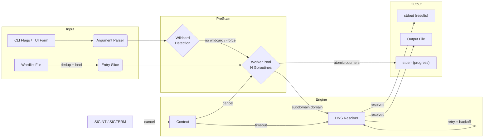

<div align="center">


<br>

[](https://github.com/TMHSDigital/subenum/actions)
[](https://github.com/TMHSDigital/subenum/releases)
[](https://go.dev)
[](LICENSE)
[](https://github.com/TMHSDigital/subenum/actions/workflows/codeql.yml)
[](https://goreportcard.com/report/github.com/TMHSDigital/subenum)
[](./docs/CONTRIBUTING.md)
[](#installation)

<br>

**Fast concurrent subdomain enumeration, written in Go.** Point it at a domain and a wordlist; it brute-forces DNS across a worker pool and prints the subdomains that resolve. Built for pentesters, bug-bounty hunters, and operators doing authorized reconnaissance of their own infrastructure.

<br>


<br>

[Quick Start](#quick-start) &nbsp;|&nbsp; [Configuration](#configuration) &nbsp;|&nbsp; [Usage](#usage) &nbsp;|&nbsp; [Architecture](#system-architecture) &nbsp;|&nbsp; [Changelog](./CHANGELOG.md)

</div>

<br>

---

> [!IMPORTANT]
> **Authorized use only.** Only scan domains you own or have explicit written permission to test. Unauthorized scanning may violate applicable laws. Users are solely responsible for compliance with all applicable laws and regulations.

---

<br>

## Quick Start

```bash
go install github.com/TMHSDigital/subenum@latest
subenum yourdomain.com     # a domain you own or are authorized to test
```

With no `-w`, subenum uses its built-in list of the 5,000 most common subdomain labels (from SecLists, MIT-licensed), so a first scan finds real results without hunting for a wordlist. See [Choosing a wordlist](#choosing-a-wordlist) for larger lists.

Or build from a clone, which also gives you the sample wordlists used below:

```bash
git clone https://github.com/TMHSDigital/subenum.git
cd subenum
go build -buildvcs=false -o subenum
./subenum -w examples/sample_wordlist.txt example.com
```

No network required to try it out. Simulation mode generates synthetic results with zero DNS queries:

```bash
./subenum -simulate -hit-rate 20 -w examples/sample_wordlist.txt example.com
```

Or launch the interactive terminal UI with no flags:

```bash
./subenum -tui
```

<br>

## Why subenum

Tools like [puredns](https://github.com/d3mondev/puredns), [shuffledns](https://github.com/projectdiscovery/shuffledns) and [dnsx](https://github.com/projectdiscovery/dnsx) are built for raw mass resolution, and [subfinder](https://github.com/projectdiscovery/subfinder) covers passive sources. subenum is a single static binary focused on telling you how much to trust the result:

- **It accounts for every query.** Each lookup is classified as resolved, nxdomain, timeout, refused or other. `-stats` writes a versioned JSON report with a `complete` / `degraded` / `unreliable` verdict that CI can gate on, and when more than 20% of queries fail the scan stops and blames the resolver instead of returning a quietly incomplete list.
- **It handles wildcards,** including CDN and load-balancer pools that rotate their answers. With `-force`, answers matching the wildcard fingerprint are dropped, inconclusive wildcard checks are reported rather than read as "no wildcard", and recursive scans skip wildcard branches.
- **Its resolver pool cannot lie to you.** `-r resolvers.txt` spreads queries over many resolvers and benches failing ones, and every hit is re-validated against your trusted `-dns-server` before it is reported.
- **Its rate limit is real.** `-rate` caps DNS packets on the wire, including retries, every record type and wildcard probes, so it can be quoted in rules of engagement.
- **It respects scope.** `-exclude` keeps out-of-scope names from ever being queried.
- **It can be taught and demoed.** `-simulate` produces marked, reproducible output with zero network traffic, and `-tui` gives a form-driven interface for people who don't live in a shell.

<br>

---

<br>

## Feature Matrix

| Module | Description |
| :--- | :--- |
| Worker Pool | Spawn N goroutines for parallel DNS resolution with a configurable concurrency ceiling |
| DNS Engine | Resolve subdomains against any DNS server with per-query timeouts and retry backoff |
| Wildcard Detection | Double-probe check before scanning; aborts early unless `-force` is set. With `-force`, answers that match the wildcard fingerprint are dropped |
| Scan Accounting | Every query is counted as resolved, nxdomain, timeout, refused, or other. After 200 queries a >20% infrastructure failure rate aborts unless `-no-abort` is set |
| Query Cap | `-max-queries` stops admitting work. Recursive scans warn about the theoretical ceiling and refuse to start above 1e7 jobs unless `-max-queries` or `-force` is set |
| Graceful Shutdown | Trap SIGINT/SIGTERM, drain in-flight workers, flush partial results |
| Input Validation | RFC-compliant domain syntax and strict `ip:port` format enforcement |
| Wordlist Hygiene | Normalize the wordlist in one pass before scanning: skip blank lines and `#` comments, lowercase, deduplicate, and drop entries that are not valid DNS labels or would exceed 253 characters |
| Simulation Mode | Generate synthetic DNS results at a configurable hit rate, with zero network I/O |
| Output Pipeline | Resolved domains to stdout (pipe-clean); progress and diagnostics to stderr |
| Output Formats | Emit results as `text`, `json` (array of subdomain plus typed records), streaming `jsonl`, or `csv` via `-format`; `-show-records` adds record values to text output |
| Rate Limiting | Cap DNS queries per second on the wire with `-rate`: every record type, retry and wildcard probe takes a slot, and queueing never eats into `-timeout` |
| Record Types | Look up and filter by `A`, `AAAA`, or `CNAME` records with `-type` |
| Recursive Enumeration | Enumerate subdomains of discovered subdomains with `-recursive` and a `-depth` cap, with loop and duplicate protection |
| Interactive TUI | Form-based config and live-scrolling results via `-tui`; session values persisted |

<br>

---

<br>

## System Architecture


```mermaid
flowchart LR
    subgraph Input
        A[Wordlist File] -->|"dedup + load"| B(Entry Slice)
        C[CLI Flags / TUI Form] --> D(Argument Parser)
    end

    subgraph PreScan
        D --> W{Wildcard\nDetection}
        W -->|"no wildcard / -force"| E
    end

    subgraph Engine
        B --> E{Worker Pool\nN Goroutines}
        E -->|subdomain.domain| F[DNS Resolver]
        F -->|retry + backoff| F
        G[Context] -->|cancel| E
        G -->|timeout| F
    end

    subgraph OutputLayer ["Output"]
        F -->|resolved| H["stdout (results)"]
        F -->|resolved| I[Output File]
        E -->|atomic counters| J["stderr (progress)"]
    end

    K[SIGINT / SIGTERM] -->|cancel| G
```

<br>

---

<br>

## Installation

**Prerequisites:** Go 1.26+ &middot; Git &middot; Make _(optional)_ &middot; Docker _(optional)_

<details>
<summary><strong>go install</strong></summary>

```bash
go install github.com/TMHSDigital/subenum@latest
```

Requires Go 1.26 or newer. The binary lands in `$(go env GOPATH)/bin` and reports the installed module version with `-version`.

</details>

<details>
<summary><strong>Build from source</strong></summary>

```bash
git clone https://github.com/TMHSDigital/subenum.git
cd subenum
go build -buildvcs=false -o subenum
```

</details>

<details>
<summary><strong>Pre-built binaries</strong></summary>

Download the archive for your platform from the [Releases](https://github.com/TMHSDigital/subenum/releases) page: `subenum_<version>_<os>_<arch>.tar.gz` (`.zip` on Windows). Each archive holds the static binary, `LICENSE`, `README.md` and `CHANGELOG.md`.

Platforms: Linux (amd64, arm64, 386) &middot; macOS (amd64, arm64) &middot; Windows (amd64, arm64) &middot; FreeBSD (amd64, arm64)

Every release also has a `checksums.txt`, a keyless [cosign](https://github.com/sigstore/cosign) signature over it, an SPDX SBOM per archive, and GitHub build-provenance attestations. To verify a download:

```bash
# 1. The archive matches the published checksum.
sha256sum --ignore-missing -c checksums.txt

# 2. checksums.txt was signed by this repository's release workflow.
cosign verify-blob --bundle checksums.txt.sigstore.json \
  --certificate-identity-regexp 'https://github.com/TMHSDigital/subenum/' \
  --certificate-oidc-issuer https://token.actions.githubusercontent.com \
  checksums.txt

# 3. Or check the build provenance with the GitHub CLI.
gh attestation verify subenum_<version>_linux_amd64.tar.gz --owner TMHSDigital
```

Releases up to v0.8.0 shipped bare binaries with one `.sha256` file each.

</details>

<details>
<summary><strong>Docker</strong></summary>

Releases from v0.8.0 onward publish a multi-arch image (`linux/amd64`, `linux/arm64`) to GHCR:

```bash
docker run --rm -v "$(pwd)/data:/data" ghcr.io/tmhsdigital/subenum:latest -w /data/wordlist.txt example.com
```

Or build it locally:

```bash
docker build -t subenum .
docker run --rm -v $(pwd)/data:/data subenum -w /data/wordlist.txt example.com
```

Or with Compose:

```bash
docker compose run --rm subenum            # simulated demo, no DNS traffic
docker compose run --rm subenum -w /data/wordlist.txt yourdomain.com   # live
```

</details>

<details>
<summary><strong>Make targets</strong></summary>

```bash
make build          # compile binary
make test           # run test suite with race detector
make lint           # run golangci-lint
make simulate       # safe run - no DNS queries
make tui            # launch interactive TUI
make docker-build   # build Docker image
make help           # list all targets
```

</details>

<br>

---

<br>

## Configuration

### CLI flags

| Flag | Default | Description |
| :--- | :---: | :--- |
| `-w <file>` | bundled top-5000 | Wordlist file, one prefix per line; `#` comments allowed; `-` reads stdin. Omit it to use the built-in list (see [Choosing a wordlist](#choosing-a-wordlist)) |
| `-dL <file>` | n/a | File of apex domains to scan, one per line (`-` reads stdin), instead of a `<domain>` argument. Each domain is an independent scan; results share one output |
| `-t <n>` | `100` | Concurrent worker goroutines |
| `-timeout <ms>` | `1000` | DNS timeout in milliseconds, applied to each record-type lookup separately |
| `-dns-server <ip:port>` | `8.8.8.8:53` | DNS server address (validated on startup) |
| `-attempts <n>` | `1` | DNS resolution attempts per subdomain (1 = no retry) |
| `-force` | `false` | Continue scanning even if wildcard DNS is detected |
| `-no-abort` | `false` | Keep scanning after the 20% resolver failure-rate abort (warning is still emitted) |
| `-max-queries <n>` | `0` | Max candidate names to test (0 = unlimited). Each name sends one query per record type per attempt (`CNAME` costs two) |
| `-o <file>` | n/a | Write results to file in addition to stdout |
| `-format <fmt>` | `text` | Output format: `text`, `json`, `jsonl` (one object per line, streamed), or `csv` |
| `-show-records` | `false` | In `text` format, append each result's records as `TYPE=value` |
| `-rate <qps>` | `0` | Max DNS queries per second on the wire, all workers combined, including every record type, retry, wildcard probe and the preflight (0 = unlimited) |
| `-type <list>` | `A,AAAA` | Comma-separated record types to look up: `A`, `AAAA`, `CNAME` |
| `-recursive` | `false` | Recursively enumerate subdomains of discovered subdomains |
| `-depth <n>` | `1` | Max recursion depth when `-recursive` is set (1 = no recursion) |
| `-v` | `false` | Verbose output: IPs, timings, per-query detail (stderr) |
| `-progress` | `true` | Live progress line on stderr. Off by default when stderr is not a terminal; passing `-progress` there prints whole progress lines instead of redrawing one |
| `-simulate` | `false` | Simulation mode: no real DNS queries |
| `-hit-rate <n>` | `15` | Simulated resolution rate, percent (1-100), applied uniformly to every name |
| `-seed <n>` | `0` | Simulation seed; the same seed reproduces the same results (line order can vary unless `-t 1`). `0` picks a random seed and prints it |
| `-diff <file>` | n/a | Compare with a previous results file (any format): print only names added (`+`) or removed (`-`), exit `4` when anything changed. See [Monitoring](docs/monitoring.md) |
| `-r <file>` | n/a | Resolver pool: one `ip` or `ip:port` per line. Lookups rotate over the healthy resolvers (a resolver failing over half its recent lookups is benched for 30s), retries go to a different resolver, and every hit is re-validated against `-dns-server`, whose answer is the one reported. Preflight and wildcard checks use `-dns-server` |
| `-exclude <list>` | n/a | Comma-separated out-of-scope names: exact (`vpn.example.com`) or `*.parent` (every name below `parent`, not `parent` itself). Excluded names are never queried, probed or expanded, and are counted as `excluded` |
| `-exclude-file <file>` | n/a | Same patterns, one per line (`#` comments allowed), e.g. a bug-bounty program's out-of-scope list |
| `-stats <file>` | n/a | Write a JSON run-quality report (outcomes, queries sent, verdict); see [Run-quality report](#run-quality-report) |
| `-tui` | `false` | Launch the interactive Terminal UI |
| `-version` | n/a | Print version and exit |
| `-retries <n>` | n/a | **Deprecated** - alias for `-attempts`, prints a warning |

<br>

> [!NOTE]
> Wildcard DNS is detected automatically before scanning begins. If the target resolves wildcard records, or the wildcard probes fail so the check is inconclusive, the tool exits with a warning, since all subdomains would match, making results meaningless. Pass `-force` to override. With `-force`, results whose records are a subset of the wildcard fingerprint are still dropped and counted as `wildcard-filtered`. The fingerprint comes from several random probes, and when the wildcard answers from a rotating CDN or load-balancer pool, subenum keeps probing until it has learned the pool; a result that shares only some records with the fingerprint is re-checked against fresh probes. Recursive scans probe each new parent and skip expanding wildcard branches.

> [!CAUTION]
> Simulation mode (`-simulate`) generates synthetic results and performs zero network I/O. Do not confuse simulated output with real DNS data. Simulated output marks itself: JSON and JSONL results carry `"simulated": true`, CSV gets a `simulated` column, and `-o` text files start with a `# SIMULATED` comment line. Bare names piped to stdout stay unmarked so they still pipe cleanly.

<br>

---

<br>

## Usage

### CLI

```bash
subenum -w <wordlist> [flags] <domain>
subenum -w <wordlist> [flags] -dL <domains_file>
```

<details>
<summary><strong>Examples</strong></summary>

**Basic scan**
```bash
./subenum -w wordlist.txt example.com
```

**High-throughput with Cloudflare DNS, saving results**
```bash
./subenum -w wordlist.txt -t 300 -timeout 500 -dns-server 1.1.1.1:53 -o results.txt example.com
```

**Resilient scan for flaky networks**
```bash
./subenum -w wordlist.txt -attempts 3 -timeout 2000 example.com
```

**Pipe-friendly - only resolved subdomains on stdout**
```bash
./subenum -w wordlist.txt example.com | your-takeover-scanner
```

**Force scan on a wildcard domain**
```bash
./subenum -w wordlist.txt -force example.com
```

**Simulation - zero network I/O**
```bash
./subenum -simulate -hit-rate 20 -w examples/sample_wordlist.txt example.com
```

</details>

Press `Ctrl+C` at any time to abort. In-flight queries drain, partial results are flushed, and the process exits with code 130 (143 for SIGTERM, as sent by `docker stop` or systemd). Interrupted lookups are not counted as resolver failures.

**Exit codes**

| Code | Meaning |
|------|---------|
| `0` | Success |
| `1` | A scan, the wordlist, the domain list or the output file failed |
| `2` | Invalid flags or arguments |
| `3` | `-dL`: some targets failed while others completed |
| `4` | `-diff`: names were added or removed since the previous run |
| `130` | Interrupted (SIGINT, `Ctrl+C`); partial results are kept |
| `143` | Terminated (SIGTERM); partial results are kept |

With `-dL`, each domain is scanned in turn as an independent scan: `-max-queries`, `-rate` and the reliability guard apply per target. A failed target does not stop the others, but a reliability abort (the resolver looks overloaded) skips the remaining targets unless `-no-abort` is set. A per-target status list is printed at the end.

### Choosing a wordlist

Results can only be as good as the wordlist. Without `-w`, subenum uses its bundled top-5000 list (`data/subdomains-5k.txt`, from SecLists' `subdomains-top1million-5000.txt`), a good first pass that takes seconds. For deeper coverage:

| List | Size | Notes |
|------|------|-------|
| [SecLists `Discovery/DNS`](https://github.com/danielmiessler/SecLists/tree/master/Discovery/DNS) | 5k to 1M+ | `subdomains-top1million-20000.txt` and `-110000.txt` are the usual next steps |
| [Assetnote wordlists](https://wordlists.assetnote.io/) (`best-dns-wordlist.txt`) | ~9M | Built from real DNS data; for long, thorough scans |
| [n0kovo subdomains](https://github.com/n0kovo/n0kovo_subdomains) | 50k to 3M | Tiered lists from scraped certificates |
| [trickest wordlists](https://github.com/trickest/wordlists) | varies | Also maintains a public resolver list for `-r` |

List size sets the query volume: each entry costs one query per record type (two with the default `A,AAAA`), per attempt, per recursion level. A 1M-entry list at `-rate 500` is about 70 minutes of wire time per target, so pair big lists with `-rate` (and `-r` for a resolver pool), and use `-max-queries` as a budget. `tools/wordlist-gen` builds a small target-specific list from a domain's own terms.

### Monitoring for new subdomains

`-diff previous.jsonl` reports only what changed since an earlier run: `+ name` for new subdomains and `- name` for ones that disappeared (only when the run's verdict is `complete`, so failed lookups are never mistaken for removals). The `-o` file keeps the full current results for the next comparison, and the exit code is `4` when anything changed. [docs/monitoring.md](docs/monitoring.md) has a ready-to-use scheduled GitHub Actions workflow that opens an issue when new names appear.

```bash
subenum -w wordlist.txt -format jsonl -diff previous.jsonl -o current.jsonl example.com
```

### Subdomain takeover hints

When a result has a CNAME record, subenum resolves the CNAME target with the trusted resolver and marks the result as a takeover candidate:

| Marker | Meaning |
|--------|---------|
| `dangling` | The CNAME target does not exist (NXDOMAIN) |
| `provider:<name>` | The target is at a service where dangling records have allowed takeovers (S3, GitHub Pages, Heroku, Azure, Fastly, Shopify, ...) |
| `dangling:<name>` | Both: a takeover-prone service and a target that does not exist |

The marker is a `takeover_candidate` field in JSON and JSONL, a `takeover_candidate` column in CSV, `TAKEOVER?=<marker>` in text with `-show-records`, and a count in the breakdown and the run-quality report. A dangling CNAME makes A/AAAA lookups fail, so scan with CNAME records included to find them: `-type A,AAAA,CNAME`.

> [!IMPORTANT]
> Takeover markers are DNS-only hints. subenum makes no HTTP requests; a `provider:` match is often a perfectly healthy service. Verify every candidate by hand, and only against targets you are authorized to test.

### Run-quality report

Every lookup is accounted for, and subenum says how far the results can be trusted. `-stats run.json` writes a report in any format, and `-format jsonl` ends with the same object as its last line (`"type": "summary"`):

```json
{
  "type": "summary",
  "schema": 1,
  "tool": "subenum",
  "version": "vX.Y.Z",
  "started": "2026-10-04T21:00:00Z",
  "duration_ms": 41230,
  "simulated": false,
  "resolver": "1.1.1.1:53",
  "rate_limit": 200,
  "queries_sent": 8214,
  "achieved_qps": 199.2,
  "verdict": "degraded",
  "reason": "61 of 4096 lookups failed (timeout 58, refused 3, other 0)",
  "targets": [
    {
      "domain": "example.com",
      "status": "ok",
      "processed": 4096, "total": 4096, "found": 37,
      "outcomes": { "resolved": 37, "nxdomain": 3998, "timeout": 58, "refused": 3, "other": 0, "wildcard_filtered": 0, "excluded": 0 },
      "queries_sent": 8214,
      "skipped_by_cap": 0,
      "wildcard": false,
      "verdict": "degraded",
      "reason": "61 of 4096 lookups failed (timeout 58, refused 3, other 0)"
    }
  ]
}
```

| Verdict | Meaning |
|---------|---------|
| `complete` | Under 1% of lookups failed and nothing was skipped |
| `degraded` | Usable, but some names are unknown: 1-20% of lookups failed, `-max-queries` skipped candidates, or the run was interrupted |
| `unreliable` | Over 20% of lookups failed (the reliability guard's threshold), the guard aborted the scan, or the target could not be scanned |

The overall `verdict` is the worst target verdict. `queries_sent` counts DNS messages actually dialed, including retries; it is 0 in simulation mode. SERVFAIL and other errors Go's resolver does not distinguish are counted under `other`. With `-r`, each target also reports `pool_hits`, `confirmed` and `unconfirmed` (hits the trusted resolver denied, so they were dropped), and the top level gains `resolvers`: per-resolver `lookups`, `found`, `nxdomain`, `failed` and `benched` counts; `resolver` is then the trusted resolver. `excluded` counts candidates `-exclude` kept out of scope; they are never queried. `status` is one of `ok`, `failed`, `interrupted`, `skipped` or `not_run`. The `schema` number changes only when a field is renamed, removed or changes meaning; new fields can appear at any time.

Gate a CI job on the verdict with `jq`:

```bash
subenum -w wordlist.txt -stats run.json example.com > found.txt
jq -e '.verdict == "complete"' run.json > /dev/null || { jq -r .reason run.json; exit 1; }
```

<br>

### Interactive TUI

```bash
./subenum -tui
```

No flags required. Fill in the form and press `ctrl+r` to start scanning. Last-used values are saved to `~/.config/subenum/last.json` and restored on next launch. The interface is shown at the top of this README.

<br>

<details>
<summary><strong>TUI keyboard reference</strong></summary>

| Key | Action |
| :--- | :--- |
| `tab` / `shift+tab` / `↑` `↓` | Navigate fields |
| `space` | Toggle Simulate / Force |
| `ctrl+r` | Start scan |
| `ctrl+c` | Abort a running scan; quit the form or a finished scan |
| `r` | New scan - restores last-used values |
| `q` | Quit after scan completes |

</details>

<br>

---

<br>

## Tech Stack

| Layer | Components |
| :--- | :--- |
| Core Engine | Go 1.26 &middot; `net.Resolver` &middot; `context` &middot; `sync/atomic` |
| Concurrency | goroutines &middot; channels &middot; `sync.WaitGroup` &middot; `sync.Mutex` |
| TUI | Bubble Tea &middot; Bubbles (textinput, viewport, progress) &middot; Lip Gloss |
| Infrastructure | Docker &middot; distroless static nonroot &middot; Make &middot; docker-compose |
| CI/CD | GitHub Actions &middot; CodeQL &middot; Dependabot &middot; golangci-lint v2 |
| Quality | `go test -race` &middot; gosec &middot; govet &middot; staticcheck |

<br>

---

<br>

<details>
<summary><strong>Project structure</strong></summary>

<br>

```
subenum/
├── .github/
│   ├── workflows/
│   │   ├── go.yml              # CI: build, test, lint, release
│   │   ├── codeql.yml          # Weekly CodeQL security analysis
│   │   └── pages.yml           # GitHub Pages deployment
│   ├── ISSUE_TEMPLATE/
│   │   ├── bug_report.md
│   │   └── feature_request.md
│   ├── dependabot.yml
│   └── PULL_REQUEST_TEMPLATE.md
├── data/
│   └── wordlist.txt            # Default wordlist for Docker/Make
├── docs/
│   ├── assets/
│   │   └── tui-form.png        # TUI screenshot
│   ├── ARCHITECTURE.md
│   ├── CONTRIBUTING.md
│   ├── DEVELOPER_GUIDE.md
│   ├── docker.md
│   ├── _config.yml
│   └── index.md
├── examples/
│   ├── sample_wordlist.txt
│   ├── advanced_usage.md
│   └── demo.sh
├── internal/
│   ├── dns/                    # ResolveTypes, ResolveDomainWithRetry, CheckWildcard, SimulateResolve
│   ├── output/                 # Thread-safe Writer (stdout/stderr separation)
│   ├── scan/                   # Scan engine: Config, Event types, Run()
│   ├── tui/                    # Bubble Tea UI: form, scan view, session config
│   └── wordlist/               # LoadWordlist (dedup + sanitize)
├── tools/
│   └── wordlist-gen.go
├── main.go                     # CLI entry point
├── main_test.go
├── go.mod
├── Dockerfile
├── docker-compose.yml
├── Makefile
├── .golangci.yml               # golangci-lint v2 configuration
├── CHANGELOG.md
├── SECURITY.md
└── LICENSE                     # GNU General Public License v3.0
```

</details>

<br>

---

<br>

## Development

See [CONTRIBUTING.md](./docs/CONTRIBUTING.md) for the pull request workflow and ethical guidelines.
See [DEVELOPER_GUIDE.md](./docs/DEVELOPER_GUIDE.md) for build setup, testing, and project structure.

<br>

---

<br>

<div align="center">

[GPL-3.0 License](./LICENSE) &nbsp;&middot;&nbsp; [Security Policy](./SECURITY.md) &nbsp;&middot;&nbsp; [TM Hospitality Strategies](https://github.com/TMHSDigital)

</div>
