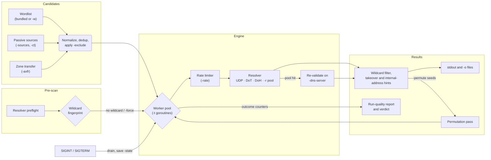
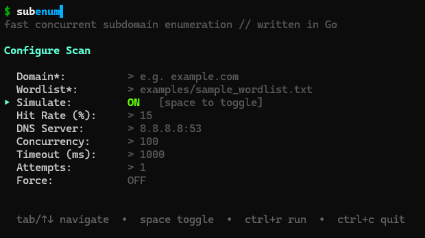

<div align="center">


<br>

[](https://github.com/TMHSDigital/subenum/actions)
[](https://github.com/TMHSDigital/subenum/releases)
[](https://pkg.go.dev/github.com/TMHSDigital/subenum/pkg/subenum)
[](https://github.com/TMHSDigital/subenum/pkgs/container/subenum)
[](https://go.dev)


### Fast, concurrent subdomain enumeration that tells you how far to trust the result.

Point it at a domain; it brute-forces DNS across a worker pool, accounts for every query, and prints the subdomains that resolve.<br>
Built for pentesters, bug-bounty hunters, and operators doing authorized reconnaissance of their own infrastructure.


**[Website](https://tmhsdigital.github.io/subenum/)** &nbsp;·&nbsp; [Quick Start](#quick-start) &nbsp;·&nbsp; [Install](#installation) &nbsp;·&nbsp; [Flags](#cli-flags) &nbsp;·&nbsp; [Labs](docs/labs.md) &nbsp;·&nbsp; [Go library](#go-library) &nbsp;·&nbsp; [MCP](#ai-agents-mcp) &nbsp;·&nbsp; [Changelog](./CHANGELOG.md)

</div>

> [!IMPORTANT]
> **Authorized use only.** Only scan domains you own or have explicit written permission to test. Unauthorized scanning may violate applicable laws. Users are solely responsible for compliance with all applicable laws and regulations.

<details>
<summary><strong>Contents</strong></summary>

<br>

- [Quick Start](#quick-start) · [Why subenum](#why-subenum) · [Features](#features) · [How it works](#how-it-works)
- [Installation](#installation)
- [Configuration](#configuration): [CLI flags](#cli-flags) · [Defaults, completions and the man page](#defaults-completions-and-the-man-page)
- [Usage](#usage): [CLI](#cli) · [Resuming a scan](#resuming-an-interrupted-scan) · [DoT and DoH](#encrypted-dns-dot-and-doh) · [Choosing a wordlist](#choosing-a-wordlist)
- [Finding more names](#finding-more-names): [Certificate Transparency](#certificate-transparency-names-no-wordlist-has) · [Zone transfers](#zone-transfers-the-whole-zone-in-one-query) · [Permutations](#permutations-a-second-pass)
- [Reading the results](#reading-the-results): [Run-quality report](#run-quality-report) · [Takeover hints](#subdomain-takeover-hints) · [Internal addresses](#internal-addresses) · [Monitoring](#monitoring-for-new-subdomains)
- [Other interfaces](#other-interfaces): [TUI](#interactive-tui) · [Go library](#go-library) · [AI agents (MCP)](#ai-agents-mcp)
- [Development](#development)

</details>

## Quick Start

```bash
go install github.com/TMHSDigital/subenum@latest
subenum yourdomain.com     # a domain you own or are authorized to test
```

With no `-w`, subenum uses its built-in list of the 5,000 most common subdomain labels (from SecLists, MIT-licensed), so a first scan finds real results without hunting for a wordlist. See [Choosing a wordlist](#choosing-a-wordlist) for larger lists.

Or build from a clone, which also gives you the sample wordlists used below:

```bash
git clone https://github.com/TMHSDigital/subenum.git
cd subenum
go build -buildvcs=false -o subenum
./subenum -w examples/sample_wordlist.txt example.com
```

No network required to try it out. Simulation mode generates synthetic results with zero DNS queries, and the terminal UI needs no flags at all:

```bash
./subenum -simulate -hit-rate 20 -w examples/sample_wordlist.txt example.com
./subenum -tui
```

## Why subenum

Tools like [puredns](https://github.com/d3mondev/puredns), [shuffledns](https://github.com/projectdiscovery/shuffledns) and [dnsx](https://github.com/projectdiscovery/dnsx) are built for raw mass resolution, and [subfinder](https://github.com/projectdiscovery/subfinder) covers passive sources. subenum is a single static binary focused on telling you how much to trust the result:

- **It accounts for every query.** Each lookup is classified as resolved, nxdomain, timeout, refused or other. `-stats` writes a versioned JSON report with a `complete` / `degraded` / `unreliable` verdict that CI can gate on, and when more than 20% of queries fail the scan stops and blames the resolver instead of returning a quietly incomplete list.
- **It handles wildcards,** including CDN and load-balancer pools that rotate their answers. With `-force`, answers matching the wildcard fingerprint are dropped, inconclusive wildcard checks are reported rather than read as "no wildcard", and recursive scans skip wildcard branches.
- **Its resolver pool cannot lie to you.** `-r resolvers.txt` spreads queries over many resolvers and benches failing ones. Every hit is re-validated against your trusted `-dns-server` before it is reported, and a resolver that hides existing names is caught by canary checks and second opinions, then taken out of rotation.
- **Its rate limit is real.** `-rate` caps DNS packets on the wire, including retries, every record type and wildcard probes, so it can be quoted in rules of engagement.
- **It respects scope.** `-exclude` keeps out-of-scope names from ever being queried.
- **It can be taught and demoed.** `-simulate` produces marked, reproducible output with zero network traffic, and `-tui` gives a form-driven interface for people who don't live in a shell.

## Features

| | |
| :--- | :--- |
| **Find names** | Bundled top-5000 wordlist or your own (`-w`, repeatable) · keyless passive sources: Certificate Transparency and the Wayback Machine (`-sources`, `-ct`) · zone transfers and NSEC walkability (`-axfr`) · permutation second pass (`-permute`) · recursive enumeration (`-recursive`, `-depth`) |
| **Resolve** | Worker pool (`-t`) · UDP with TCP fallback, DNS over TLS and DNS over HTTPS · resolver pools with benching, canaries and re-validation (`-r`) · `A`, `AAAA`, `CNAME`, `NS`, `MX` and `TXT` records (`-type`) |
| **Stay polite** | Wire-level rate limit (`-rate`, `-rate-per-resolver`) that adapts under load (`-auto-rate`) · query and time budgets (`-max-queries`, `-max-duration`) · scope exclusions (`-exclude`) · `-dry-run` to see the plan first |
| **Trust the output** | Multi-probe wildcard fingerprinting · per-outcome accounting and a run-quality verdict (`-stats`) · reliability guard · retry of inconclusive names (`-retry-inconclusive`) · resumable runs (`-resume`) |
| **Spot problems** | Dangling CNAME and NS takeover hints, with a provider list you can extend · internal addresses leaked into public DNS · SARIF for GitHub code scanning (`-sarif`) |
| **Fit your workflow** | `text`, `json`, streaming `jsonl` and `csv` · pipe-clean stdout (`-silent`) · `-diff` monitoring and a GitHub Action · interactive TUI · Go library · MCP server for AI agents |
| **Teach and test** | `-simulate` with zero network I/O · lab scenarios served by a local DNS server (`-simulate-zone`), with [six guided exercises](docs/labs.md) |

## How it works


```mermaid
flowchart LR
    subgraph Candidates
        WL["Wordlist<br/>(bundled or -w)"] --> N("Normalize, dedup,<br/>apply -exclude")
        PS["Passive sources<br/>(-sources, -ct)"] --> N
        AX["Zone transfer<br/>(-axfr)"] --> N
    end

    subgraph PreScan ["Pre-scan"]
        PF["Resolver preflight"] --> W{"Wildcard<br/>fingerprint"}
    end

    subgraph Engine
        N --> Q{"Worker pool<br/>(-t goroutines)"}
        W -->|"no wildcard / -force"| Q
        Q --> RL["Rate limiter<br/>(-rate)"]
        RL --> R["Resolver<br/>UDP · DoT · DoH · -r pool"]
        R -->|"pool hit"| V["Re-validate on<br/>-dns-server"]
    end

    subgraph Results
        R --> F["Wildcard filter,<br/>takeover and internal-address hints"]
        V --> F
        F --> O["stdout and -o files"]
        F -->|"-permute seeds"| PM["Permutation pass"]
        Q -->|"outcome counters"| S["Run-quality report<br/>and verdict"]
    end

    PM --> Q
    SIG["SIGINT / SIGTERM"] -->|"drain, save -state"| Q
```

<div align="right"><sub><a href="#readme">↑ back to top</a></sub></div>

## Installation

**Prerequisites:** Go 1.26+ &middot; Git &middot; Make _(optional)_ &middot; Docker _(optional)_

<details>
<summary><strong>go install</strong></summary>

```bash
go install github.com/TMHSDigital/subenum@latest
```

Requires Go 1.26 or newer; an older 1.26 release fetches the patched toolchain named in `go.mod` automatically (the default `GOTOOLCHAIN=auto`). The binary lands in `$(go env GOPATH)/bin` and reports the installed module version with `-version`.

</details>

<details>
<summary><strong>Build from source</strong></summary>

```bash
git clone https://github.com/TMHSDigital/subenum.git
cd subenum
go build -buildvcs=false -o subenum
```

</details>

<details>
<summary><strong>Pre-built binaries</strong></summary>

Download the archive for your platform from the [Releases](https://github.com/TMHSDigital/subenum/releases) page: `subenum_<version>_<os>_<arch>.tar.gz` (`.zip` on Windows). Each archive holds the static binary, `LICENSE`, `THIRD_PARTY_LICENSES` (the licence notices of the Go standard library and the modules linked into the binary; from the next release on, v0.10.0 archives do not have it), `README.md`, `CHANGELOG.md`, shell completions (`completions/`) and the man page (`man/`).

Platforms: Linux (amd64, arm64, 386) &middot; macOS (amd64, arm64) &middot; Windows (amd64, arm64) &middot; FreeBSD (amd64, arm64)

Every release also has a `checksums.txt`, a keyless [cosign](https://github.com/sigstore/cosign) signature over it, an SPDX SBOM per archive, and GitHub build-provenance attestations. To verify a download:

```bash
# 1. The archive matches the published checksum.
sha256sum --ignore-missing -c checksums.txt

# 2. checksums.txt was signed by this repository's release workflow.
cosign verify-blob --bundle checksums.txt.sigstore.json \
  --certificate-identity-regexp 'https://github.com/TMHSDigital/subenum/' \
  --certificate-oidc-issuer https://token.actions.githubusercontent.com \
  checksums.txt

# 3. Or check the build provenance with the GitHub CLI.
gh attestation verify subenum_<version>_linux_amd64.tar.gz --owner TMHSDigital
```

Releases up to v0.8.0 shipped bare binaries with one `.sha256` file each.

</details>

<details>
<summary><strong>Docker</strong></summary>

Releases from v0.8.0 onward publish a multi-arch image (`linux/amd64`, `linux/arm64`) to GHCR:

```bash
docker run --rm -v "$(pwd)/data:/data" ghcr.io/tmhsdigital/subenum:latest -w /data/wordlist.txt example.com
```

Or build it locally:

```bash
docker build -t subenum .
docker run --rm -v $(pwd)/data:/data subenum -w /data/wordlist.txt example.com
```

Or with Compose:

```bash
docker compose run --rm subenum            # simulated demo, no DNS traffic
docker compose run --rm subenum -w /data/wordlist.txt yourdomain.com   # live
```

</details>

<details>
<summary><strong>Make targets</strong></summary>

```bash
make build          # compile binary
make test           # run test suite (CI also runs it with -race)
make lint           # run golangci-lint
make simulate       # safe run - no DNS queries
make tui            # launch interactive TUI
make docker-build   # build Docker image
make help           # list all targets
```

</details>

<div align="right"><sub><a href="#readme">↑ back to top</a></sub></div>

## Configuration

### CLI flags

This table describes `main`, which can be ahead of the latest release: a release binary rejects a flag or value added since. The website's [CLI reference](https://tmhsdigital.github.io/subenum/cli/) tags what is not released yet.

<details>
<summary><strong>All 50 flags</strong>, grouped by purpose</summary>

<br>

| Flag | Default | Description |
| :--- | :---: | :--- |
| **Targets and scope** | | |
| `-w <file>` | bundled top-5000 | Wordlist file, one prefix per line; `#` comments allowed; `-` reads stdin. Repeat it to combine lists (`-w general.txt -w target.txt`); entries found in more than one are scanned once. Omit it to use the built-in list (see [Choosing a wordlist](#choosing-a-wordlist)) |
| `-dL <file>` | n/a | File of apex domains to scan, one per line (`-` reads stdin), instead of a `<domain>` argument. Each domain is an independent scan; results share one output |
| `-type <list>` | `A,AAAA` | Comma-separated record types to look up: `A`, `AAAA`, `CNAME`, `NS`, `MX`, `TXT`. A name is found when it has a record of any listed type. `CNAME` and `NS` also check for [takeovers](#subdomain-takeover-hints); `MX` values are `<preference> <host>` |
| `-exclude <list>` | n/a | Comma-separated out-of-scope names: exact (`vpn.example.com`) or `*.parent` (every name below `parent`, not `parent` itself). Excluded names are never queried, probed or expanded, and are counted as `excluded`. A target that is itself out of scope is refused before `-axfr`, `-ct`/`-sources` or the `-dry-run` preflight touch it, and `-axfr` never resolves or contacts an excluded name server |
| `-exclude-file <file>` | n/a | Same patterns, one per line (`#` comments allowed), e.g. a bug-bounty program's out-of-scope list |
| **Finding more names** | | |
| `-sources <list>` | n/a | Keyless passive sources whose names become candidates and `-permute` seeds: `ct` (crt.sh), `wayback` (Wayback Machine). One HTTPS request per source and target |
| `-ct` | `false` | Add names from Certificate Transparency logs (crt.sh; one HTTPS request per target, no API key) as candidates and `-permute` seeds |
| `-axfr` | `false` | Try a zone transfer (AXFR) from each of the target's name servers first; names it gives become candidates and `-permute` seeds. Also reports a zone that DNSSEC NSEC lets anyone walk |
| `-permute` | `false` | After each scan, scan permutations of discovered names (`api` → `api-dev`, `dev-api`, `dev.api`, `api2`, ...) |
| `-seeds <file>` | n/a | Results file (any `-format`) whose names also seed `-permute`; implies `-permute` |
| `-recursive` | `false` | Recursively enumerate subdomains of discovered subdomains |
| `-depth <n>` | `1` | Max recursion depth when `-recursive` is set (1 = no recursion) |
| **Resolvers and pacing** | | |
| `-dns-server <addr>` | `8.8.8.8:53` | DNS server: `ip:port` (UDP, TCP fallback), `tls://host[:853]` (DNS over TLS) or `https://host/path` (DNS over HTTPS); validated on startup |
| `-r <file>` | n/a | Resolver pool: one `ip` or `ip:port` per line. Lookups rotate over the healthy resolvers (a resolver failing over half its recent lookups is benched for 30s), retries go to a different resolver, and every hit is re-validated against `-dns-server`, whose answer is the one reported. NXDOMAIN answers are checked too: each resolver is periodically asked about a name `-dns-server` confirmed (a canary), and an NXDOMAIN from one that has not passed a canary is confirmed by a second resolver. A resolver contradicted three times is flagged and dropped for the run. Preflight and wildcard checks use `-dns-server` |
| `-t <n>` | `100` | Concurrent worker goroutines |
| `-timeout <ms>` | `1000` | DNS timeout in milliseconds, applied to each record-type lookup separately |
| `-attempts <n>` | `1` | DNS resolution attempts per subdomain (1 = no retry) |
| `-retries <n>` | n/a | **Deprecated** - alias for `-attempts`, prints a warning |
| `-rate <qps>` | `0` | Max DNS queries per second on the wire, all workers combined, including every record type, retry, wildcard probe and the preflight (0 = unlimited) |
| `-rate-per-resolver <qps>` | `0` | With `-r`, max DNS queries per second sent to each pool resolver (0 = unlimited). Lookups go to resolvers with room first and wait only when every cap is spent; `-rate` still caps the total, so the stricter limit wins. Each resolver's `throttled` count is in the end-of-run table and the run-quality report |
| `-auto-rate` | `false` | When more than 20% of the last 200 lookups failed, halve the query rate (from the rate reached so far when `-rate` is 0) and keep going, with a `rate` notice; speed back up by a quarter at a time, to the rate it started from, once a window of lookups is healthy. Only after 6 back-offs, or at 5 queries/s, does the reliability guard abort. The report counts `rate_backoffs` and the `final_rate`. Pairs well with `-retry-inconclusive`, which retries the names that failed while the resolver was overloaded |
| `-max-queries <n>` | `0` | Max candidate names to test (0 = unlimited). Each name sends one query per record type per attempt |
| `-max-duration <d>` | `0` | Time budget for the whole run, e.g. `20m` (0 = unlimited). Then no new names are tested, lookups already under way finish, and the run ends normally with its results, report (`stopped_by: "duration"`) and a `degraded` verdict, and saves a `-state` file so `-resume` tests the rest. Under `-dL` it covers all targets. The resolver preflight and wildcard probes made before a target's first name are not counted |
| **Reliability** | | |
| `-force` | `false` | Continue scanning even if wildcard DNS is detected |
| `-no-abort` | `false` | Keep scanning after the 20% resolver failure-rate abort (warning is still emitted) |
| `-retry-inconclusive` | `false` | After each scan, look up once more (against `-dns-server`, never the `-r` pool) every name that timed out, was refused or failed. An answer replaces the first outcome in the counts; a name that resolves is reported, but not expanded by `-recursive`. Skipped after an abort, an interrupt or once `-max-duration` runs out. The report counts `retried` and `recovered` |
| `-inconclusive <file>` | n/a | Write the names still without an answer (timeout, refused, other) to this file, one per line, sorted, so a later run can retry them with `-w <file>` |
| **Output** | | |
| `-o <file>` | n/a | Write results to file in addition to stdout; repeat for several files, each in `-format` or in the format named as a prefix (`-o names.txt -o jsonl:results.jsonl`) |
| `-format <fmt>` | `text` | Output format: `text`, `json`, `jsonl` (one object per line, streamed), or `csv` |
| `-show-records` | `false` | In `text` format, append each result's records as `TYPE=value` |
| `-silent` | `false` | Pipeline mode: bare result names on stdout, only errors (and a one-line simulation warning) on stderr. See [Pipelines](https://tmhsdigital.github.io/subenum/pipelines.html) |
| `-v` | `false` | Verbose output: IPs, timings, per-query detail (stderr) |
| `-progress` | `true` | Live progress line on stderr. Off by default when stderr is not a terminal; passing `-progress` there prints whole progress lines instead of redrawing one |
| `-log-format <fmt>` | `text` | Diagnostics on stderr: `text`, or `json` for one JSON object per line (`time`, `level`, `kind`, `target`, `message`, and `settings` codes on engine notices). Progress is then an event, only with an explicit `-progress`. Results on stdout are unchanged |
| `-stats <file>` | n/a | Write a JSON run-quality report (outcomes, queries sent, verdict); see [Run-quality report](#run-quality-report) |
| `-sarif <file>` | n/a | Write takeover candidates as SARIF 2.1.0 for GitHub code scanning; needs CNAME or NS in `-type` |
| `-takeover-providers <file>` | n/a | Extra takeover-prone services for the `provider:` hint, one `<suffix> <name>` per line (`.example-cdn.net example-cdn`; `#` comments allowed). They are added to the built-in list; an entry for a listed suffix replaces it, and a name of `-` removes the suffix. The longest matching suffix wins. See [Subdomain takeover hints](#subdomain-takeover-hints) |
| `-takeover-providers-only` | `false` | Use only the `-takeover-providers` file, without the built-in list |
| **Monitoring** | | |
| `-diff <file>` | n/a | Compare with a previous results file (any format): print only names added (`+`) or removed (`-`), exit `4` when anything changed. See [Monitoring](docs/monitoring.md) |
| `-diff-records` | `false` | With `-diff`, also report names whose records changed (`~`): a re-pointed CNAME or moved addresses, compared over the `-type` record types. Needs a JSON, JSONL or CSV `-diff` file |
| **Resuming** | | |
| `-resume <file>` | n/a | Resume a run that was interrupted, ran out of `-max-duration` or was aborted, from its state file; takes no other arguments but the pacing flags (`-rate`, `-t`, `-timeout`, ...) |
| `-state <file>` | `subenum-resume.json` | Where a run that was interrupted, ran out of `-max-duration` or was aborted saves its state for `-resume` |
| **Simulation and labs** | | |
| `-simulate` | `false` | Simulation mode: no real DNS queries |
| `-hit-rate <n>` | `15` | Simulated resolution rate, percent (1-100), applied uniformly to every name |
| `-seed <n>` | `0` | Simulation seed; the same seed reproduces the same results (line order can vary unless `-t 1`). `0` picks a random seed and prints it |
| `-simulate-zone <file>` | n/a | Lab mode: answer every query from a scenario file, or a built-in scenario such as `lab1` (`lab1`-`lab6`, with their own wordlist when `-w` is not given), via a local DNS server on `127.0.0.1`; no traffic leaves the machine. See [Labs](docs/labs.md) |
| **Modes** | | |
| `-tui` | `false` | Launch the interactive Terminal UI |
| `-dry-run` | `false` | Print the plan without scanning: candidates after dedupe and `-exclude`, query and duration estimates, and the resolver preflight (its only DNS query, paced by `-rate` and skipped for a target `-exclude` rules out), then exit; JSON with `-format json` or `jsonl` |
| `-print-config` | `false` | Print every setting's effective value and source (`flag`, env, config or default), then exit |
| `-version` | n/a | Print version and exit |

</details>

> [!NOTE]
> Wildcard DNS is detected automatically before scanning begins. If the target resolves wildcard records, or the wildcard probes fail so the check is inconclusive, the tool exits with a warning, since all subdomains would match, making results meaningless. Pass `-force` to override. With `-force`, results whose records are a subset of the wildcard fingerprint are still dropped and counted as `wildcard-filtered`. The fingerprint comes from several random probes, and when the wildcard answers from a rotating CDN or load-balancer pool, subenum keeps probing until it has learned the pool; a result that shares only some records with the fingerprint is re-checked against fresh probes. Recursive scans probe each new parent and skip expanding wildcard branches.

> [!CAUTION]
> Simulation mode (`-simulate`) generates synthetic results and performs zero network I/O. Do not confuse simulated output with real DNS data. Simulated output marks itself: JSON and JSONL results carry `"simulated": true`, CSV gets a `simulated` column, and `-o` text files start with a `# SIMULATED` comment line. Bare names piped to stdout stay unmarked so they still pipe cleanly.

> [!TIP]
> For teaching, `-simulate-zone lab.zone` goes further than `-simulate`: a scenario file defines exact names, records, wildcards, failures and resolver rate limits, and a DNS server on `127.0.0.1` answers from it. The real resolver, wildcard filtering, `-rate` and the run-quality report all run unchanged, deterministically and with no traffic leaving the machine. [docs/labs.md](docs/labs.md) has six guided exercises with answers, built on the scenarios in `examples/labs/`, which every binary carries: `subenum -simulate-zone lab1 lab.example` runs the first one from any directory.

### Defaults, completions and the man page

Settings you repeat on every run can live in a config file or the environment. Precedence, highest first: **command-line flag > `SUBENUM_*` environment variable > config file > built-in default.**

```json
{ "dns-server": "1.1.1.1:53", "rate": 200, "t": 50, "r": "/home/me/resolvers.txt" }
```

- The config file is `config.json` in your user config directory (`~/.config/subenum/` on Linux, `~/Library/Application Support/subenum/` on macOS, `%AppData%\subenum\` on Windows), or the path in `SUBENUM_CONFIG`. Keys are flag names; values are strings, numbers or booleans, and `exclude`, `type` and `sources` also take a list of strings. The repeatable `w` and `o` take a list too, one file per entry (`"o": ["names.txt", "jsonl:results.jsonl"]`); a string for them, in the config file or in `SUBENUM_W`/`SUBENUM_O`, is a comma-separated list, so name a file whose path has a comma in a list entry or on the command line.
- Each flag also reads `SUBENUM_<FLAG>`, upper-cased with dashes as underscores: `SUBENUM_DNS_SERVER`, `SUBENUM_RATE`, `SUBENUM_T`. Mode flags (`tui`, `version`, `print-config`, `dry-run`, `resume`) are command-line only.
- The TUI (`-tui`) starts its form from these values too, and from flags and the domain given with `-tui` on the command line, over the values it remembers from its last session.
- `subenum -print-config` shows every effective setting and where it came from (`flag`, `env`, `config` or `default`). It, `-h` and `-version` still work when a value is bad, so you can find it; a scan refuses to start and names every bad value.

Shell completions and a man page are generated from the same flags, and release archives include them under `completions/` and `man/`:

```bash
subenum completion bash > /etc/bash_completion.d/subenum      # or zsh, fish, powershell
subenum completion zsh > "${fpath[1]}/_subenum"
subenum man > /usr/local/share/man/man1/subenum.1
```

<div align="right"><sub><a href="#readme">↑ back to top</a></sub></div>

## Usage

### CLI

```bash
subenum -w <wordlist> [flags] <domain>
subenum -w <wordlist> [flags] -dL <domains_file>
```

<details>
<summary><strong>Examples</strong></summary>

**Basic scan**
```bash
./subenum -w wordlist.txt example.com
```

**High-throughput with Cloudflare DNS, saving results**
```bash
./subenum -w wordlist.txt -t 300 -timeout 500 -dns-server 1.1.1.1:53 -o results.txt example.com
```

**Resilient scan for flaky networks**
```bash
./subenum -w wordlist.txt -attempts 3 -timeout 2000 example.com
```

**Pipe-friendly - only resolved subdomains on stdout**
```bash
./subenum -w wordlist.txt example.com | your-takeover-scanner
```

**Force scan on a wildcard domain**
```bash
./subenum -w wordlist.txt -force example.com
```

**Simulation - zero network I/O**
```bash
./subenum -simulate -hit-rate 20 -w examples/sample_wordlist.txt example.com
```

</details>

Press `Ctrl+C` at any time to abort. In-flight queries drain, partial results are flushed, and the process exits with code 130 (143 for SIGTERM, as sent by `docker stop` or systemd). Interrupted lookups are not counted as resolver failures.

With `-dL`, each domain is scanned in turn as an independent scan: `-max-queries`, `-rate` and the reliability guard apply per target. A failed target does not stop the others, but a reliability abort (the resolver looks overloaded) skips the remaining targets unless `-no-abort` is set. A per-target status list is printed at the end.

<details>
<summary><strong>Exit codes</strong></summary>

<br>

| Code | Meaning |
|------|---------|
| `0` | Success |
| `1` | A scan, the wordlist, the domain list or the output file failed |
| `2` | Invalid flags or arguments |
| `3` | `-dL`: some targets failed while others completed |
| `4` | `-diff`: names were added or removed (or, with `-diff-records`, changed) since the previous run; `subenum diff`: the two files differ |
| `130` | Interrupted (SIGINT, `Ctrl+C`); partial results are kept, in the resume state when the `-o` file is also the `-diff` baseline, which is left unchanged |
| `143` | Terminated (SIGTERM); partial results are kept as for `130` |

</details>

### Resuming an interrupted scan

On `Ctrl+C` or SIGTERM, subenum saves where it stopped to `subenum-resume.json` (or the path given with `-state`): the original command line, a checksum of each input file, the position in the wordlist per target, and the results found so far. Continue with:

```bash
subenum -resume subenum-resume.json
```

The only flags `-resume` accepts next to the state file are the pacing flags `-attempts`, `-auto-rate`, `-max-duration`, `-no-abort`, `-rate`, `-rate-per-resolver`, `-t` and `-timeout`: for example `subenum -resume subenum-resume.json -rate 20 -auto-rate` continues a scan that timeouts slowed down at a gentler rate. They apply over the saved command line and are recorded in the next state file. Flags that change which names are queried or how wildcards are detected (`-w`, `-type`, `-dns-server`, `-depth` and the rest) cannot change on a resume.

<details>
<summary><strong>What a resume checks and repeats</strong></summary>

<br>

The resumed run refuses to start if an input file, the wordlist (including the bundled one, which changes with the binary) or an effective setting (for example a `SUBENUM_*` variable or the config file) changed. It re-emits the earlier results (so `-o` and JSON output end up complete), skips targets that had finished, and continues the interrupted one from the first wordlist entry not yet fully looked up; a `-permute` pass resumes from its own position. At most about one worker pool's worth (`-t`) of lookups is repeated, and `-max-queries` covers the whole scan, so a resumed run only gets what is left of it. In recursive mode, names found before the interrupt have their children re-scanned; a run stopped in its `-permute` pass resumes in that pass and does not scan the finished main pass again. A resumed run that finishes deletes its state file. A run that `-max-duration` stopped with names untested, or that the reliability guard aborted, saves the same state (its exit code does not change), so `-resume` continues it too: a scheduled job with a time budget can work through a large wordlist over several runs (the GitHub Action does this itself when `max-duration` and `baseline-artifact` are set, keeping the state in the baseline artifact). When `-diff` and `-o` name the same file, a run that saves a resume state leaves that file unchanged, so the resumed run compares against the same baseline and then writes the full results. Runs that read the wordlist or domain list from stdin cannot be resumed.

</details>

### Encrypted DNS: DoT and DoH

Where outbound UDP/53 is blocked or intercepted, point `-dns-server` at an encrypted resolver:

```bash
subenum -dns-server tls://1.1.1.1 example.com                          # DNS over TLS (port 853)
subenum -dns-server https://cloudflare-dns.com/dns-query example.com   # DNS over HTTPS
```

DoT connections are pooled and reused, and DoH uses one keep-alive HTTP client (HTTP/2 where the server offers it), so most queries skip the TLS handshake. Outcome classification and `-rate` accounting are identical to UDP, and the run-quality report names the `transport`. `-r` resolver pools are plain UDP; with `-r`, an encrypted `-dns-server` is the trusted resolver that re-validates every hit.

### Choosing a wordlist

Results can only be as good as the wordlist. Without `-w`, subenum uses its bundled top-5000 list (`data/subdomains-5k.txt`, from SecLists' `subdomains-top1million-5000.txt`), a good first pass that takes seconds. For deeper coverage:

| List | Size | Notes |
|------|------|-------|
| [SecLists `Discovery/DNS`](https://github.com/danielmiessler/SecLists/tree/master/Discovery/DNS) | 5k to 1M+ | `subdomains-top1million-20000.txt` and `-110000.txt` are the usual next steps |
| [Assetnote wordlists](https://wordlists.assetnote.io/) (`best-dns-wordlist.txt`) | ~9M | Built from real DNS data; for long, thorough scans |
| [n0kovo subdomains](https://github.com/n0kovo/n0kovo_subdomains) | 50k to 3M | Tiered lists from scraped certificates |
| [trickest wordlists](https://github.com/trickest/wordlists) | varies | Also maintains a public resolver list for `-r` |

List size sets the query volume: each entry costs one query per record type (two with the default `A,AAAA`), per attempt, per recursion level. A 1M-entry list at `-rate 500` is about 70 minutes of wire time per target, so pair big lists with `-rate` (and `-r` for a resolver pool), and use `-max-queries` as a budget. `tools/wordlist-gen` builds a small target-specific list from a domain's own terms.

Entries are prefixes. An entry that already ends in the target, such as `www.example.com` pasted from another tool's output, is scanned as `www` under `example.com`, and the scan notes how many entries it shortened.

<div align="right"><sub><a href="#readme">↑ back to top</a></sub></div>

## Finding more names

A wordlist only finds names someone thought to put in it. These passes add candidates from elsewhere; every one of them is still resolved like any other name, so a stale source costs a query, never a false result.

> **Unreleased:** `-sources`, the per-result `sources` field and `-axfr` are on `main` but not in v0.10.0, the latest release, which rejects them; `-ct` and `-permute` are released. Until the next release, build from main: `go install github.com/TMHSDigital/subenum@main`.

### Certificate Transparency: names no wordlist has

Certificates name the hosts they cover, so Certificate Transparency logs show real names, including forgotten ones like `legacy-billing`, that no generic wordlist contains. `-ct` asks [crt.sh](https://crt.sh/) once per target (HTTPS, no API key) and adds the names under the target as candidates after the wordlist, and as seeds for `-permute`. They are only candidates: each is resolved like any other name, so expired certificates cost a query, never a false result.

```bash
subenum -ct -permute example.com
```

The run-quality report counts them per target (`ct_names`). If crt.sh is down or slow, the scan warns, records `ct_error` and carries on with the wordlist. The CT request goes to crt.sh, not to the target and not through `-rate`; lab mode (`-simulate-zone`) refuses `-ct`, and a resumed scan reuses the names the interrupted run fetched.

`-ct` is one of several keyless passive sources, chosen with `-sources`: `ct` (as `-ct`) and `wayback`, the hostnames in the Wayback Machine's index of archived URLs, which often remembers hosts long gone from DNS and certificates. Each is one HTTPS request per target, and each name is still looked up.

```bash
subenum -sources ct,wayback example.com
```

<details>
<summary><strong>Retries, limits, and which source proposed each result</strong></summary>

<br>

The sources of a target are asked at the same time, and a busy answer (429, 502, 503, 504) or a dropped connection is retried twice with a short backoff, honouring `Retry-After`, within the source's 60-second limit. The report has one `sources` entry per source, with the names it added or the `error` it hit; a failed source is a warning, and the scan goes on with the others. The Wayback Machine is asked for at most 200,000 URLs and 64 MiB, and crt.sh's answer is read up to 64 MiB; when a source reaches a limit its names are still used, a note says some hosts may be missing, and its entry is marked `truncated`. Simulation ignores `-sources`, lab mode refuses it, and a resumed scan reuses what each source returned.

Each result says what proposed it: a `sources` list in JSON and JSONL, and a `sources` column in CSV (joined with `;`). The values are `wordlist`, `ct`, `wayback` and `axfr`, every one that had the name, in that order, or `permute` alone for a `-permute` hit; text output is unchanged. The report counts the results each source had proposed as `found` in its `sources` entry, and `axfr_found` for a zone transfer, so you can see whether a source earns its request:

```bash
subenum -sources ct,wayback -format jsonl example.com | jq -r 'select(.sources == ["wayback"]) | .subdomain'
```

</details>

### Zone transfers: the whole zone in one query

A name server that allows anyone a zone transfer (AXFR) lists every name in the zone, and finding one is a misconfiguration worth reporting in itself. `-axfr` looks up the target's name servers through `-dns-server` and asks each of them for a transfer over TCP before the scan. Most refuse, which is correct and stays quiet (`-v` shows each refusal). When one allows it, subenum says so on stderr, names the server in the report (`axfr_allowed`, with `axfr_names`), and adds the names as candidates after the wordlist and as `-permute` seeds. Like `-ct` names they are only candidates: each is still looked up, so a stale entry is never reported.

```bash
subenum -axfr -type A,AAAA,CNAME example.com
```

<details>
<summary><strong>NSEC zone walking and query budget</strong></summary>

<br>

The same step asks one name server about a name that does not exist, with DNSSEC records requested. A zone signed with plain NSEC proves the absence by naming its neighbours, so anyone can walk the chain to list every name, transfer or not: subenum reports that as `Zone walkable` and records `zone_denial` (`nsec`, `nsec3` or `none`) in the report. It does not walk the zone itself.

The transfers and the probe go straight to the target's name servers, not through `-dns-server`: at most 8 servers and 2 addresses each, one query per address, plus the NS and address lookups and one denial probe, all counted in the report's `queries_sent` but not paced by `-rate`. Simulation ignores `-axfr`, lab mode refuses it, and a resumed scan reuses the names the interrupted run got.

</details>

### Permutations: a second pass

Once `api.example.com` and `dev.example.com` exist, the next names most likely to exist are `api-dev`, `dev-api`, `dev.api` and `api2`. `-permute` runs a second scan per target over permutations of the names the first pass found: built-in environment and role words (`dev`, `staging`, `prod`, `qa`, `internal`, `v1`, ...) joined with `-` on either side or as a new level, plus number increments (`api2` -> `api1`, `api3`, `api4`). `-seeds results.jsonl` adds names from an earlier run (any format) and implies `-permute`.

```bash
subenum -permute -format jsonl -o results.jsonl example.com
```

<details>
<summary><strong>How the pass is scoped and reported</strong></summary>

<br>

The pass is a normal scan with the same preflight, wildcard filtering, `-rate`, `-max-queries` and `-exclude`; candidates already in the wordlist, and any whose full name would pass 253 characters, are skipped. It is one level deep even under `-recursive`, so a permutation hit is reported but not expanded further. Its hits carry `"permutation": true` in JSON/JSONL, and the run-quality report shows the seeds, candidates, hits, `processed` and `queries_sent` of the pass per target. The target's `queries_sent` includes the pass, and its `verdict` is the worse of the two passes'; when it is the permutation pass's, the `reason` starts with `permutation pass:`.

</details>

<div align="right"><sub><a href="#readme">↑ back to top</a></sub></div>

## Reading the results

### Run-quality report

Every lookup is accounted for, and subenum says how far the results can be trusted. `-stats run.json` writes a report in any format, and `-format jsonl` ends with the same object as its last line (`"type": "summary"`).

<details>
<summary><strong>Example report</strong></summary>

<br>

```json
{
  "type": "summary",
  "schema": 1,
  "tool": "subenum",
  "version": "vX.Y.Z",
  "started": "2026-10-04T21:00:00Z",
  "duration_ms": 41230,
  "simulated": false,
  "resolver": "1.1.1.1:53",
  "rate_limit": 200,
  "queries_sent": 8214,
  "achieved_qps": 199.2,
  "verdict": "degraded",
  "reason": "61 of 4096 lookups failed (timeout 58, refused 3, other 0)",
  "targets": [
    {
      "domain": "example.com",
      "status": "ok",
      "processed": 4096, "total": 4096, "found": 37,
      "outcomes": { "resolved": 37, "nxdomain": 3998, "timeout": 58, "refused": 3, "other": 0, "wildcard_filtered": 0, "excluded": 0 },
      "queries_sent": 8214,
      "skipped_by_cap": 0,
      "wildcard": false,
      "verdict": "degraded",
      "reason": "61 of 4096 lookups failed (timeout 58, refused 3, other 0)"
    }
  ]
}
```

</details>

| Verdict | Meaning |
|---------|---------|
| `complete` | Under 1% of lookups failed and nothing was skipped |
| `degraded` | Usable, but some names are unknown: 1-20% of lookups failed, `-max-queries` or `-max-duration` skipped candidates, or the run was interrupted |
| `unreliable` | Over 20% of lookups failed (the reliability guard's threshold), the guard aborted the scan, or the target could not be scanned |

<details>
<summary><strong>Field reference</strong></summary>

<br>

The overall `verdict` is the worst target verdict. `queries_sent` counts DNS messages actually dialed, including retries; it is 0 in simulation mode. SERVFAIL and other errors Go's resolver does not distinguish are counted under `other`. With `-r`, each target also reports `pool_hits`, `confirmed` and `unconfirmed` (hits the trusted resolver denied, so they were dropped), and the top level gains `resolvers`: per-resolver `lookups`, `found`, `nxdomain`, `failed`, `benched` and `throttled` (times `-rate-per-resolver` found its cap spent) counts; `resolver` is then the trusted resolver. `excluded` counts candidates `-exclude` kept out of scope; they are never queried. `status` is one of `ok`, `failed`, `interrupted`, `skipped` or `not_run`. The `schema` number changes only when a field is renamed, removed or changes meaning; new fields can appear at any time.

</details>

Gate a CI job on the verdict with `jq`:

```bash
subenum -w wordlist.txt -stats run.json example.com > found.txt
jq -e '.verdict == "complete"' run.json > /dev/null || { jq -r .reason run.json; exit 1; }
```

### Subdomain takeover hints

When a result has a CNAME record, subenum resolves the CNAME target with the trusted resolver and marks the result as a takeover candidate:

| Marker | Meaning |
|--------|---------|
| `dangling` | The CNAME target does not exist (NXDOMAIN) |
| `provider:<name>` | The target is at a service where dangling records have allowed takeovers (S3, GitHub Pages, Heroku, Azure, Fastly, Shopify, ...) |
| `dangling:<name>` | Both: a takeover-prone service and a target that does not exist |
| `dangling-ns` | With `-type` including `NS`: the name is a delegated subzone, and one of its name servers does not exist (NXDOMAIN). Whoever registers that name server answers for the whole subzone |

> [!IMPORTANT]
> Takeover markers are DNS-only hints. subenum sends no HTTP requests to the candidates; a `provider:` match is often a perfectly healthy service. Verify every candidate by hand, and only against targets you are authorized to test.

<details>
<summary><strong>Output fields, custom providers and SARIF</strong></summary>

<br>

A recursive resolver asked about a subzone whose every name server is gone usually answers SERVFAIL instead of the delegation, so such a name is reported as inconclusive (see `-inconclusive`) rather than marked; scanning against the parent zone's authoritative server finds it.

A target or name server that exists but has no A or AAAA record (NODATA, such as a name with only MX or TXT records) is not dangling: when the address lookup comes back empty, subenum sends one more A query and marks the name only on an NXDOMAIN answer. A probe that fails (timeout, SERVFAIL) marks nothing.

A CNAME target or name server that `-exclude` puts out of scope is never looked up: it can still get `provider:<name>`, which needs no query, but never `dangling` or `dangling-ns`.

The marker is a `takeover_candidate` field in JSON and JSONL, a `takeover_candidate` column in CSV, `TAKEOVER?=<marker>` in text with `-show-records`, and a count in the breakdown and the run-quality report. A dangling CNAME makes A/AAAA lookups fail, so scan with CNAME records included to find them: `-type A,AAAA,CNAME`.

The provider list is built in, and `-takeover-providers <file>` extends it without waiting for a release, for example with an in-house or regional hosting service, or drops one that is noisy for you:

```text
# suffix               name
.pages.example-cdn.net  example-cdn
.cloudfront.net         -
```

`-takeover-providers-only` uses the file alone.

`-sarif takeovers.sarif` also writes the candidates as a SARIF 2.1.0 log, one rule per kind of finding and a stable fingerprint per name, so GitHub code scanning can track, triage and dismiss them in the Security tab. Upload it from a scheduled workflow (see [Monitoring](docs/monitoring.md)) with `github/codeql-action/upload-sarif` and `security-events: write`.

</details>

### Internal addresses

A public name that answers with an internal address leaks how the network behind it is laid out (and a loopback answer is a DNS rebinding building block). Every real result is checked: when one of its A or AAAA addresses is not public, the result carries the most notable scope:

| Scope | Addresses |
|-------|-----------|
| `loopback` | `127.0.0.0/8`, `::1` |
| `unspecified` | `0.0.0.0`, `::` |
| `link-local` | `169.254.0.0/16`, `fe80::/10` |
| `private` | `10.0.0.0/8`, `172.16.0.0/12`, `192.168.0.0/16`, `fc00::/7` |
| `cgnat` | `100.64.0.0/10` |

The scope is an `internal_address` field in JSON and JSONL, `INTERNAL=<scope>` in text with `-show-records`, and a count in the breakdown and the run-quality report (`internal_addresses`). CSV is unchanged: each row already holds one address in its `value` column. Simulated results are never marked, since their addresses are invented.

A name that answered for one `-type` while another type's lookup still timed out, was refused or failed after `-attempts` is reported with the records that came back and marked partial: a `"partial": true` field in JSON and JSONL, `PARTIAL` in text with `-show-records`, and a `partial answers` count in the breakdown. Partial answers lower the run's verdict as failed lookups do, and `-diff-records` never reports a partial name as changed.

### Monitoring for new subdomains

`-diff previous.jsonl` reports only what changed since an earlier run: `+ name` for new subdomains and `- name` for ones that disappeared (only when the run's verdict is `complete`, and only after a fresh lookup of the name returns NXDOMAIN, so names this run did not test and failed lookups are never mistaken for removals). The `-o` file keeps the full current results for the next comparison, and the exit code is `4` when anything changed. The repository is also a GitHub Action (`uses: TMHSDigital/subenum@<release>`) that installs a verified release, keeps the baseline as an artifact, writes a job summary and fails on a bad verdict; [docs/monitoring.md](docs/monitoring.md) documents it and a hand-written scheduled workflow that opens an issue when new names appear.

```bash
subenum -w wordlist.txt -format jsonl -diff previous.jsonl -o current.jsonl example.com
```

To compare two results files you already have, without scanning, use `subenum diff previous.jsonl current.jsonl` (on `main` only until the next release; v0.10.0 does not have it): `+` for names only in the second file, `-` for names only in the first (missing, not proven gone, since nothing is looked up), and with `-records` `~` for names whose records differ. `-type` limits the record comparison and `-format` picks the output format; the exit code is `4` when the files differ.

<div align="right"><sub><a href="#readme">↑ back to top</a></sub></div>

## Other interfaces

### Interactive TUI

```bash
./subenum -tui
```

No flags required. Fill in the form and press `ctrl+r` to start scanning. Last-used values are saved to `last.json` in your user config directory (`~/.config/subenum/` on Linux, `~/Library/Application Support/subenum/` on macOS, `%AppData%\subenum\` on Windows) and restored on next launch.

Leaving a numeric field blank uses its built-in default.



<details>
<summary><strong>Form fields and their flags</strong></summary>

<br>

Flags and a domain given with `-tui` fill the form, so a prepared command line opens ready to run: `./subenum -tui example.com -w big.txt -r resolvers.txt`. The form takes one wordlist (the first `-w`), and `-tui` warns about flags it has no field for, except `-simulate-zone`: lab mode is rejected with exit 2 before the TUI opens. Run labs without `-tui`. **Wordlist is optional:** leave the field empty to scan with the bundled top-5000 list, as a missing `-w` does on the command line. The **Resolver Pool** and **Rate/Resolver** fields are `-r` and `-rate-per-resolver`; the pool is not used with Simulate on. **Auto Rate**, **Max Duration** (blank for none, or a duration such as `20m`) and **Retry Inconclusive** are `-auto-rate`, `-max-duration` and `-retry-inconclusive`. **Sources** takes what `-sources` does (`ct`, `wayback` or both; `-ct` fills in `ct`): the sources are asked while the wordlist loads, their names are scanned with the wordlist's, and a source that fails is a warning on the scan screen, not a failed scan; they are not asked with Simulate on. **Permute** is `-permute`: when the scan finishes, a second pass scans permutations of the names found, and its results are marked on the scan screen. With either field set, the results file says what proposed each name, as the CLI's does.

</details>

<details>
<summary><strong>TUI keyboard reference</strong></summary>

| Key | Action |
| :--- | :--- |
| `tab` / `shift+tab` / `↑` `↓` | Navigate fields |
| `space` | Toggle Simulate, Recursive, Permute, Auto Rate, Force, No Abort or Retry Inconclusive |
| `ctrl+r` | Start scan |
| `ctrl+c` | Abort a running scan; quit the form or a finished scan |
| `r` | New scan - restores last-used values |
| `q` | Quit after scan completes |
| `/` | Filter the results by name (during or after a scan); `enter` keeps the filter, `esc` clears it. While typing, every key but `ctrl+c` goes to the filter |
| `t` | Show takeover candidates only (toggle) |
| `v` | Show each result's records under it (toggle) |
| `s` | Save the results after the scan: type a path and press `enter` (`esc` cancels). An existing file requires a second `enter` to confirm overwriting. The extension picks the format (`.txt`, `.json`, `.jsonl`, `.csv`; otherwise the form's Format), and with a filter on only the results it shows are saved |
| `esc` | Clear the filter |

</details>

### Go library

The engine is importable, so a recon pipeline or custom tool can use it without shelling out:

```bash
go get github.com/TMHSDigital/subenum/pkg/subenum
```

```go
results, stats, err := subenum.Scan(ctx, subenum.Config{
    Domain: "example.com",            // URLs, ports and IDNs are normalized
    Rate:   100,                      // queries per second on the wire
    Types:  []string{"A", "AAAA", "CNAME"},
})
```

Every zero value in `Config` takes the same default as the CLI, so `Config{Domain: "example.com"}` is a complete configuration and uses the bundled wordlist. `Scan` returns a finished scan; `Run` returns a channel that streams results, notices and progress and always ends with the final `Stats`. Set `Simulate` for a run that sends no DNS queries. Wildcard filtering, rate limiting, retries, takeover hints, the reliability guard and the per-outcome accounting are all the same code the CLI runs, and the DNS internals stay unexported.

API reference and runnable examples: [pkg.go.dev/github.com/TMHSDigital/subenum/pkg/subenum](https://pkg.go.dev/github.com/TMHSDigital/subenum/pkg/subenum). The package follows semantic versioning from v1.0.0; until then it may change between minor releases, while the CLI stays stable.

### AI agents (MCP)

> [!NOTE]
> **Unreleased:** `subenum mcp` is on `main` but not in v0.10.0, the latest release, so a release binary treats `mcp` as a domain. Until the next release, build from main: `go install github.com/TMHSDigital/subenum@main`.

`subenum mcp` is a [Model Context Protocol](https://modelcontextprotocol.io) server on stdio, for AI agents and assistants:

```bash
claude mcp add subenum -- subenum mcp -allow example.com
```

It offers `lab_scan` (the lab scenarios, on a local DNS server, always safe), `scan` (only for domains in `-allow` and their subdomains) `explain_stats` (reads a `-stats` report back in plain language) and `diff` (compares two result sets without a DNS query). The operator sets the resolver, rate and budgets; the model can ask for a smaller `max_queries`, never a larger one, and can never pick a resolver. Every scan returns a verdict that tells the agent whether a missing name can be trusted to be absent. See the [MCP page](https://tmhsdigital.github.io/subenum/mcp.html).

<div align="right"><sub><a href="#readme">↑ back to top</a></sub></div>

## Development

See [CONTRIBUTING.md](./docs/CONTRIBUTING.md) for the pull request workflow and ethical guidelines, and [DEVELOPER_GUIDE.md](./docs/DEVELOPER_GUIDE.md) for build setup, testing, and project structure. Pull requests are welcome. The dev container gets you a ready toolchain in one click:

[](https://codespaces.new/TMHSDigital/subenum)

<details>
<summary><strong>Tech stack and project structure</strong></summary>

<br>

| Layer | Components |
| :--- | :--- |
| Core Engine | Go 1.26 &middot; `net.Resolver` &middot; `context` &middot; `sync/atomic` |
| Concurrency | goroutines &middot; channels &middot; `sync.WaitGroup` &middot; `sync.Mutex` |
| TUI | Bubble Tea &middot; Bubbles (textinput, viewport, progress) &middot; Lip Gloss |
| Infrastructure | Docker &middot; distroless static nonroot &middot; Make &middot; docker-compose |
| CI/CD | GitHub Actions &middot; CodeQL &middot; Dependabot &middot; golangci-lint v2 |
| Quality | `go test -race` &middot; gosec &middot; govet &middot; staticcheck |

```
subenum/
├── .devcontainer/              # Dev container, plus a labs container
├── .github/
│   ├── workflows/
│   │   ├── go.yml              # CI: build, test, lint, govulncheck, release
│   │   ├── codeql.yml          # Weekly CodeQL security analysis
│   │   ├── devcontainer.yml    # Builds the dev container and runs checks in it
│   │   └── pages.yml           # GitHub Pages deployment
│   ├── SECURITY.md             # Vulnerability disclosure policy
│   ├── CONTRIBUTING.md, CODE_OF_CONDUCT.md, FUNDING.yml
│   ├── ISSUE_TEMPLATE/         # bug_report.yml, feature_request.yml, config.yml
│   ├── scripts/                # check-links.py, release-notes.sh
│   ├── dependabot.yml
│   └── PULL_REQUEST_TEMPLATE.md
├── data/
│   ├── subdomains-5k.txt       # Bundled default wordlist, embedded by data.go
│   ├── data.go
│   └── wordlist.txt            # Sample wordlist for the Docker examples (mounted at /data)
├── docs/                       # Source of the website (GitHub Pages)
│   ├── assets/                 # Brand, CSS, JS, TUI screenshot, demo clip
│   ├── _config.yml, _data/, _includes/, _layouts/, 404.html, search.json
│   ├── ARCHITECTURE.md, CONTRIBUTING.md, CODE_OF_CONDUCT.md, DEVELOPER_GUIDE.md, ROADMAP.md
│   ├── DOCUMENTATION_STRUCTURE.md  # Where each topic is documented (not published)
│   ├── superpowers/            # Design notes and plans (not published)
│   ├── start.md, cli.md, pipelines.md, library.md, labs.md, monitoring.md, docker.md, mcp.md
│   └── index.html              # Landing page
├── examples/
│   ├── labs/                   # Lab scenario zones and their wordlist
│   ├── sample_wordlist.txt, sample_domains.txt
│   ├── advanced_usage.md
│   └── demo.sh
├── internal/
│   ├── axfr/                   # -axfr: zone transfer attempts against each name server
│   ├── candidates/             # Gathers a target's candidate names for the command line
│   ├── cli/                    # The command and its subsystems (config, diff, resume, permute, CT, labs, MCP, ...)
│   ├── cliargs/                # Flags anywhere on the command line (subenum and wordlist-gen)
│   ├── ct/                     # Certificate Transparency (crt.sh) client for -ct
│   ├── diff/                   # Result comparison shared by -diff and subenum.Diff
│   ├── dns/                    # Resolution, transports (UDP/TCP, DoT, DoH), resolver pool, wildcard checks
│   ├── dnsserver/              # Scriptable local DNS server (labs, tests)
│   ├── dnstest/                # Runs dnsserver for hermetic tests
│   ├── labzone/                # Lab scenario file parser
│   ├── mcp/                    # Minimal Model Context Protocol server (stdio) behind subenum mcp
│   ├── output/                 # Thread-safe Writer, results file, SARIF and summary writers
│   ├── passive/                # -sources: keyless passive name sources (Wayback Machine; crt.sh is in ct/)
│   ├── permute/                # -permute candidate generation
│   ├── report/                 # Run-quality report built from finished scans
│   ├── retryhttp/              # HTTP client with retries for the passive sources
│   ├── scan/                   # Scan engine: Config, Event types, Run()
│   ├── tui/                    # Bubble Tea UI: form, scan view, session config
│   ├── validate/               # Input validators shared by the CLI and the TUI
│   └── wordlist/               # Wordlist reading, sanitizing and dedup
├── pkg/subenum/                # Public Go library API
├── tools/
│   ├── wordlist-gen.go, wordlist-gen_test.go, README.md
│   └── licenses/               # Release-time third-party licence notices
├── main.go                     # Entry point: calls internal/cli
├── action.yml                  # GitHub Action
├── .goreleaser.yaml            # Release archives, completions, man page
├── go.mod
├── Dockerfile
├── docker-compose.yml
├── Makefile
├── .golangci.yml               # golangci-lint v2 configuration
├── CHANGELOG.md
├── CITATION.cff
└── LICENSE                     # GNU General Public License v3.0
```

</details>

<br>

<div align="center">

[GPL-3.0 License](./LICENSE) &nbsp;&middot;&nbsp; [Security Policy](./.github/SECURITY.md) &nbsp;&middot;&nbsp; [TM Hospitality Strategies](https://github.com/TMHSDigital)

</div>
