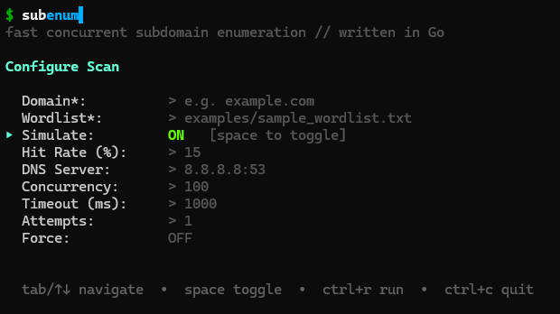

> **Authorized use only.** Only scan domains you own or have explicit written permission to test.

## What it does

subenum brute-forces subdomains by resolving a wordlist against a target domain using a concurrent worker pool. Results stream to stdout — pipe-clean, no noise. Progress, diagnostics, and errors go to stderr.

<div class="screenshot-wrap">
  <figure>
    
    <figcaption>Interactive TUI — <code>./subenum -tui</code> or <code>make tui</code></figcaption>
  </figure>
</div>

## Features

<dl class="feature-list">
  <div>
    <dt>Worker pool</dt>
    <dd>N goroutines for parallel DNS resolution. Ceiling via <code>-t</code>.</dd>
  </div>
  <div>
    <dt>Wildcard detection</dt>
    <dd>Double-probe before scanning; exits unless <code>-force</code>. Matching answers are dropped. Recursive scans skip wildcard branches.</dd>
  </div>
  <div>
    <dt>Interactive TUI</dt>
    <dd>Form-based config and live-scrolling results via <code>-tui</code>. Last session saved to <code>~/.config/subenum/last.json</code>.</dd>
  </div>
  <div>
    <dt>Simulation</dt>
    <dd>Synthetic DNS results at a configurable hit rate — zero network I/O. For demos and tests, not recon.</dd>
  </div>
  <div>
    <dt>Output formats</dt>
    <dd><code>text</code>, <code>json</code> (subdomain plus typed records), or <code>csv</code> via <code>-format</code>.</dd>
  </div>
  <div>
    <dt>Pipe-clean stdout</dt>
    <dd>Resolved names on stdout only. Compose with other tools; Ctrl+C drains in-flight workers and flushes partial results.</dd>
  </div>
</dl>

## Flags

| Flag | Default | Description |
| :--- | :--- | :--- |
| `-w <file>` | required | Wordlist, one prefix per line |
| `-t <n>` | `100` | Concurrent workers |
| `-dns-server <ip:port>` | `8.8.8.8:53` | Resolver address |
| `-force` | `false` | Continue on wildcard DNS |
| `-format <fmt>` | `text` | `text`, `json`, or `csv` |
| `-rate <qps>` | `0` | Max queries per second (`0` = unlimited) |
| `-type <list>` | `A,AAAA` | Record types: `A`, `AAAA`, `CNAME` |
| `-recursive` | `false` | Enumerate children of hits |
| `-simulate` | `false` | Synthetic results, no DNS |
| `-tui` | `false` | Interactive terminal UI |

## Quick Start

**Build from source:**

```bash
git clone https://github.com/TMHSDigital/subenum.git
cd subenum
go build -buildvcs=false -o subenum
```

**Scan / TUI / simulate:**

```bash
./subenum -w wordlist.txt example.com
./subenum -tui
./subenum -simulate -hit-rate 20 -w examples/sample_wordlist.txt example.com
```

**Docker:**

```bash
docker build -t subenum .
docker run --rm -v $(pwd)/data:/data subenum -w /data/wordlist.txt example.com
```

## Documentation

<div class="doc-nav">
  <a href="ARCHITECTURE.html">Architecture</a>
  <a href="DEVELOPER_GUIDE.html">Developer Guide</a>
  <a href="docker.html">Docker</a>
  <a href="CONTRIBUTING.html">Contributing</a>
  <a href="ROADMAP.html">Roadmap</a>
  <a href="https://github.com/TMHSDigital/subenum/blob/main/examples/advanced_usage.md">Advanced Usage</a>
  <a href="https://github.com/TMHSDigital/subenum/blob/main/CHANGELOG.md">Changelog</a>
</div>
